# DIA Window Optimizer - Architecture Diagrams

Complete architecture diagrams showing function and object relationships for Phase 1-3.

## Overview: 4-Stage Pipeline Flow

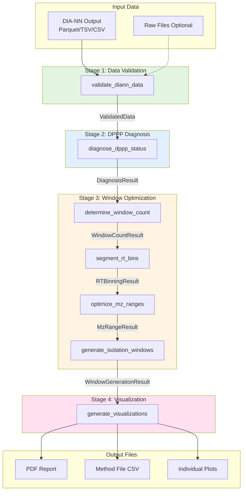

---

## Stage 1: Data Validation

### Function Dependencies

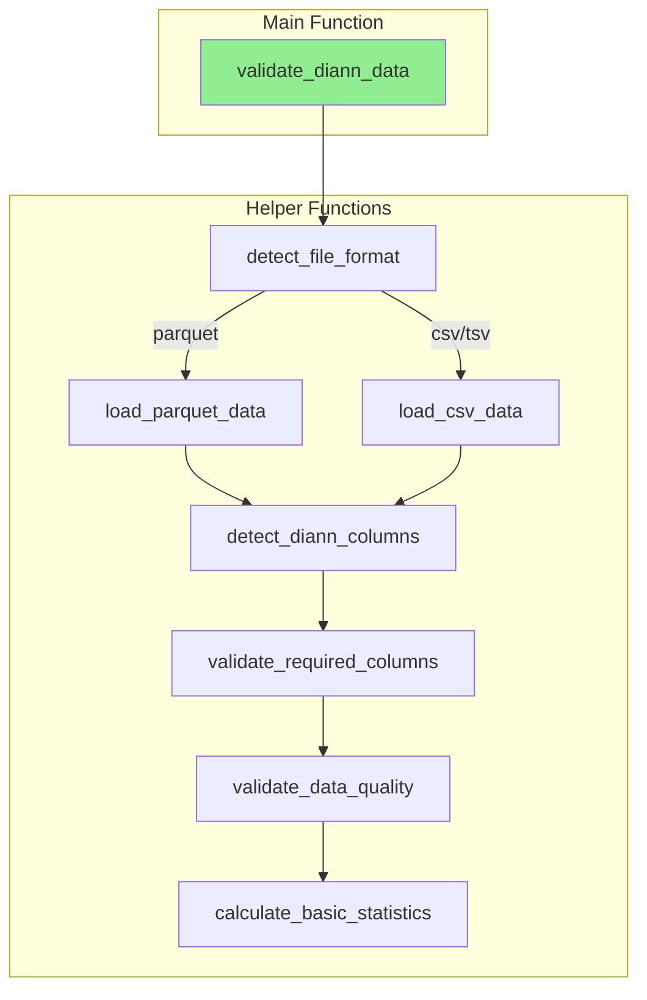

### Data Object Flow

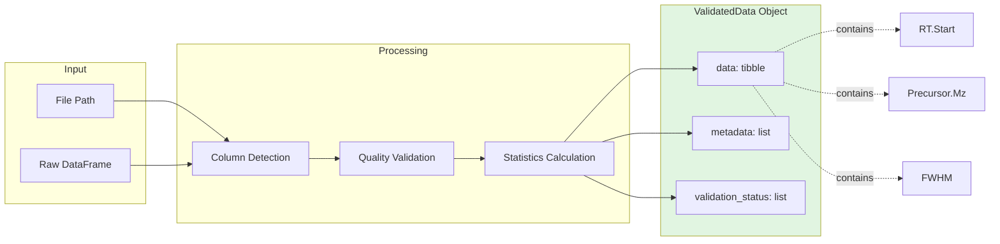

### ValidatedData S3 Object Structure

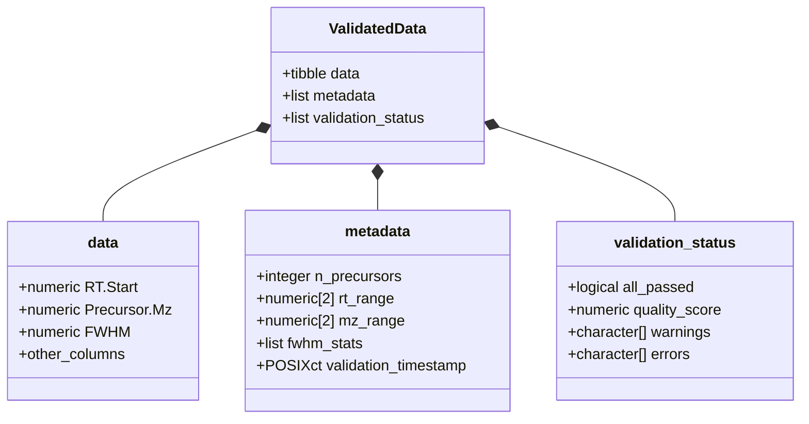

---

## Stage 2: DPPP Diagnosis

### Function Dependencies

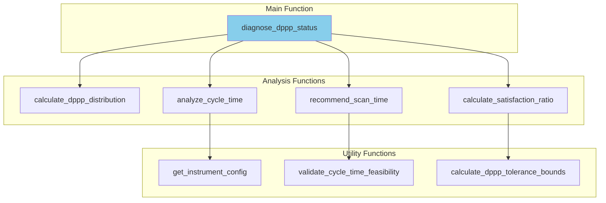

### Data Object Flow

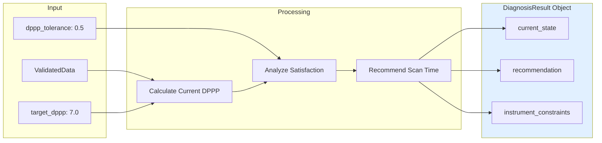

### DiagnosisResult S3 Object Structure

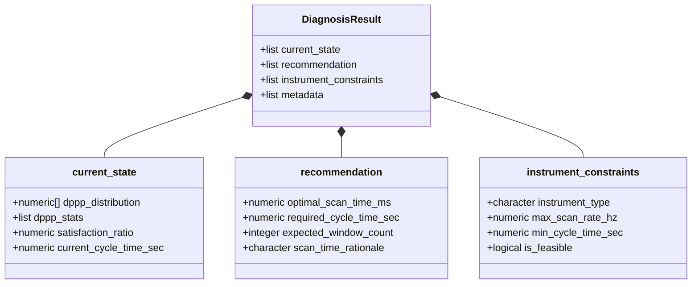

---

## Stage 3A: Window Count Determination

### Function Dependencies

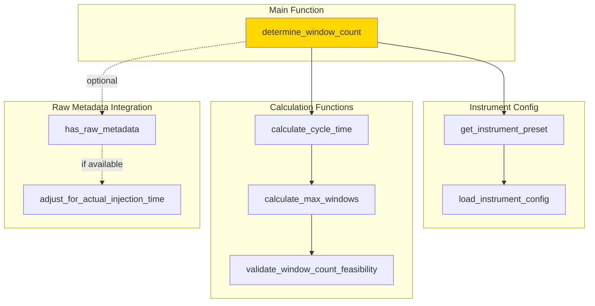

### Data Object Flow

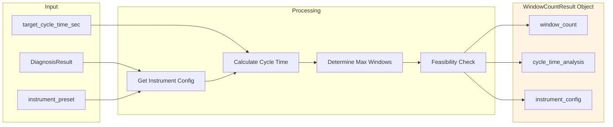

### WindowCountResult S3 Object Structure

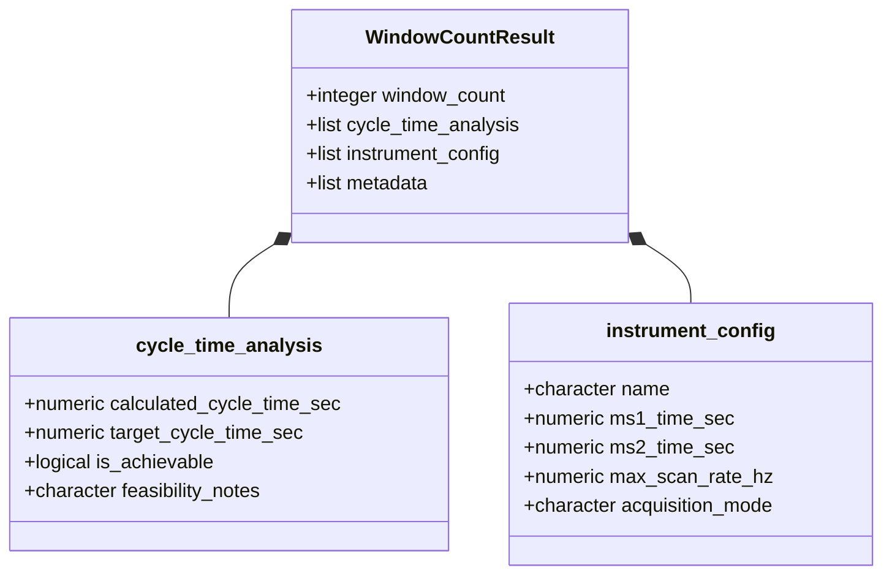

---

## Stage 3B: RT Binning

### Function Dependencies

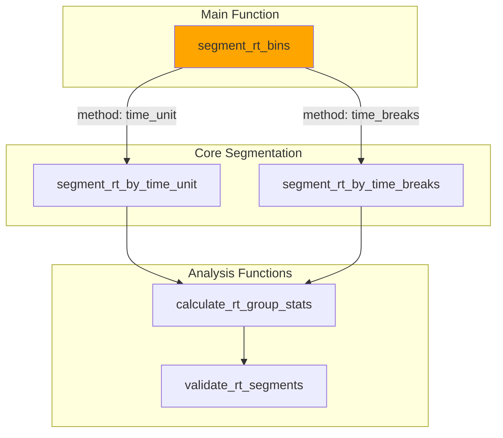

### Data Object Flow

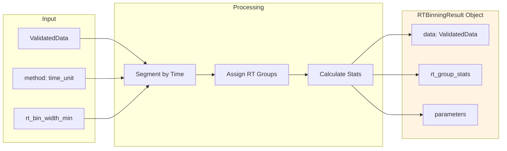

### RTBinningResult S3 Object Structure

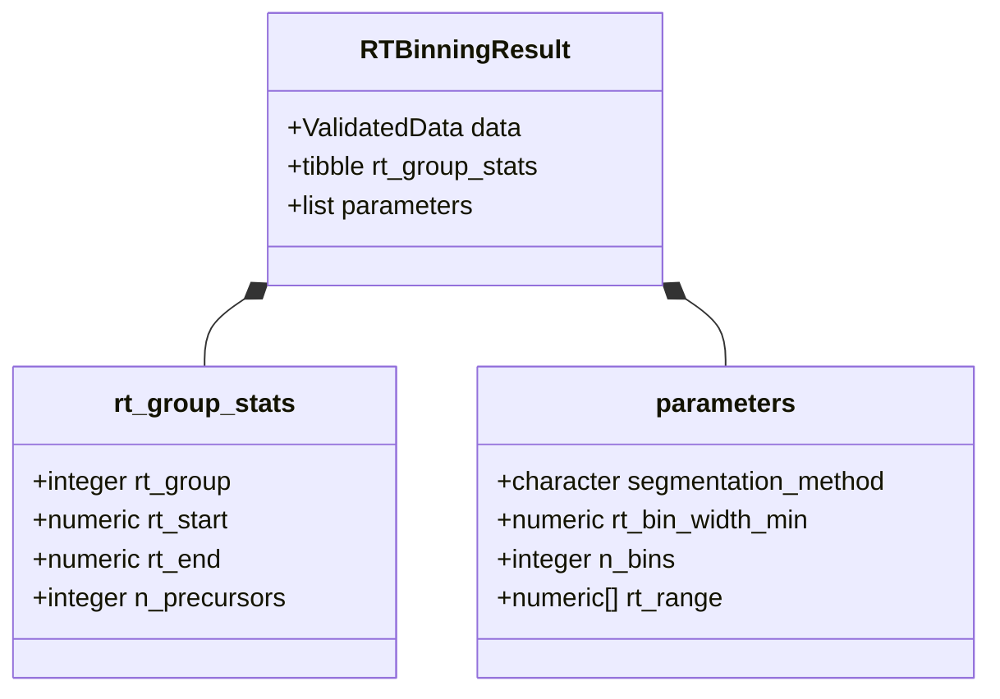

---

## Stage 3C: m/z Range Optimization

### Function Dependencies

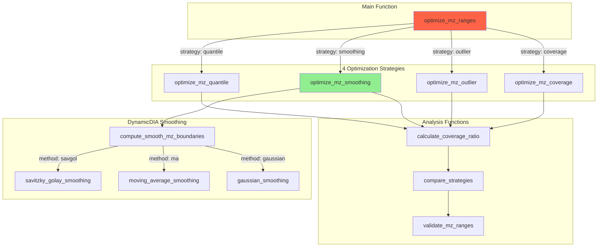

### Data Object Flow

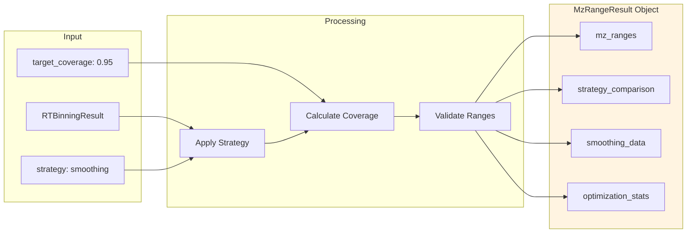

### MzRangeResult S3 Object Structure

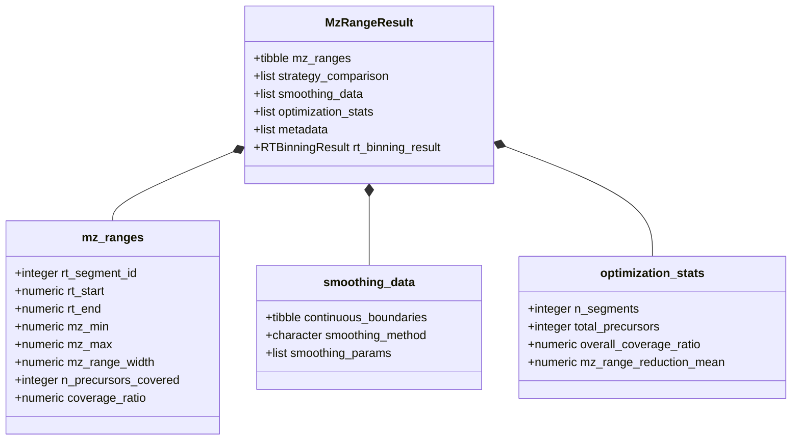

---

## Stage 3D: Window Generation

### Function Dependencies

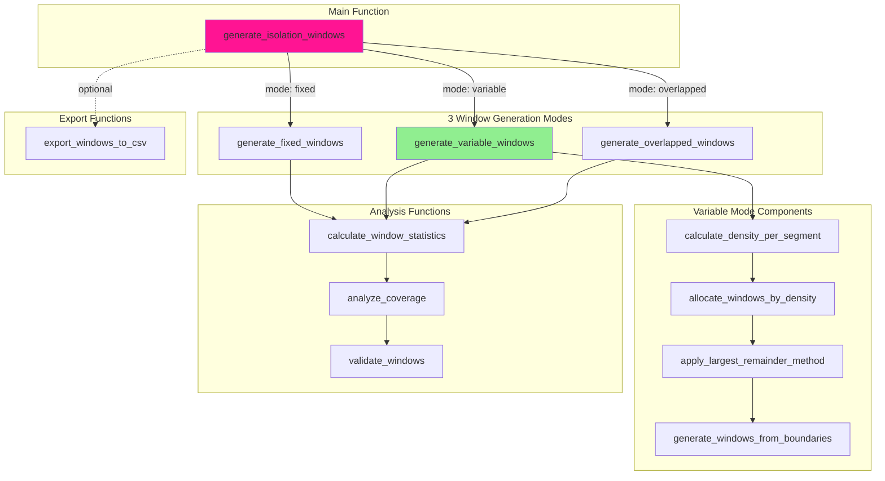

### Data Object Flow

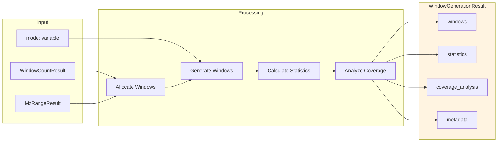

### WindowGenerationResult S3 Object Structure

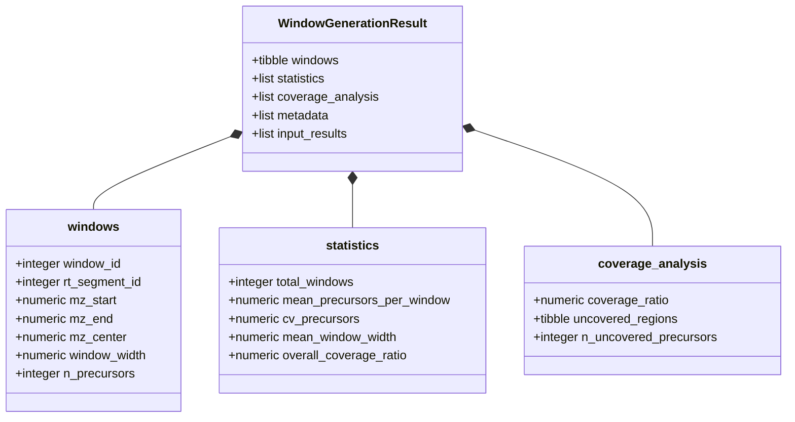

---

## Complete Data Flow: Stage 1 to Stage 3D

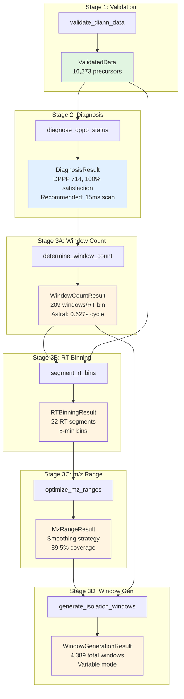

---

## Integration Points Summary

### Key Function Calls

```mermaid
sequenceDiagram
    participant User
    participant S1 as Stage 1
    participant S2 as Stage 2
    participant S3A as Stage 3A
    participant S3B as Stage 3B
    participant S3C as Stage 3C
    participant S3D as Stage 3D

    User->>S1: validate_diann_data(file_path)
    S1-->>User: ValidatedData

    User->>S2: diagnose_dppp_status(validated_data)
    S2-->>User: DiagnosisResult

    User->>S3A: determine_window_count(diagnosis)
    S3A-->>User: WindowCountResult

    User->>S3B: segment_rt_bins(validated_data)
    S3B-->>User: RTBinningResult

    User->>S3C: optimize_mz_ranges(rt_binning)
    S3C-->>User: MzRangeResult

    User->>S3D: generate_isolation_windows(window_count, mz_range)
    S3D-->>User: WindowGenerationResult
```

### Object Dependency Graph

```mermaid
graph TB
    VD[ValidatedData]
    DR[DiagnosisResult]
    WCR[WindowCountResult]
    RTR[RTBinningResult]
    MZR[MzRangeResult]
    WGR[WindowGenerationResult]

    VD -->|required by| DR
    DR -->|required by| WCR
    VD -->|required by| RTR
    RTR -->|required by| MZR
    WCR -->|required by| WGR
    MZR -->|required by| WGR

    VD -.->|stored in| RTR
    RTR -.->|stored in| MZR
    WCR -.->|stored in| WGR
    MZR -.->|stored in| WGR

    style VD fill:#e1f5e1
    style DR fill:#e1f0ff
    style WCR fill:#fff4e1
    style RTR fill:#fff4e1
    style MZR fill:#fff4e1
    style WGR fill:#fff4e1
```

---

## File Organization

```mermaid
graph TB
    subgraph R[R Directory]
        S1F[stage1_data_validation.R]
        S2F[stage2_dppp_diagnosis.R]

        subgraph S3[stage3_window_optimization]
            S3AF[module3a_window_count.R]
            S3BF[module3b_rt_binning.R]
            S3CF[module3c_mz_range_optimization.R]
            S3DF[module3d_window_generation.R]
        end

        S4F[stage4_visualization.R]

        subgraph Config[config]
            CF[instruments.R]
        end
    end

    subgraph Tests[tests]
        T1[test_stage1.R]
        T2[test_stage2.R]
        T3[test_stage3a.R]
        TF[test_final_workflow.R]
    end

    S1F -.->|tested by| T1
    S2F -.->|tested by| T2
    S3AF -.->|tested by| T3
    S1F -.->|uses| CF
    S2F -.->|uses| CF
    S3AF -.->|uses| CF

    style S1F fill:#e1f5e1
    style S2F fill:#e1f0ff
    style S3AF fill:#fff4e1
    style S3BF fill:#fff4e1
    style S3CF fill:#fff4e1
    style S3DF fill:#fff4e1
    style S4F fill:#ffe1f0
```

---

## Summary

This document provides comprehensive architecture diagrams for the DIA Window Optimizer pipeline (Phase 1-3). Each stage has:

1. **Function dependency graph**: Shows how functions call each other
2. **Data flow diagram**: Shows input to processing to output transformation
3. **S3 object structure**: Shows the internal structure of result objects
4. **Integration points**: Shows how stages connect together

All diagrams use valid Mermaid syntax compatible with GitHub, VS Code, and other Mermaid renderers.
