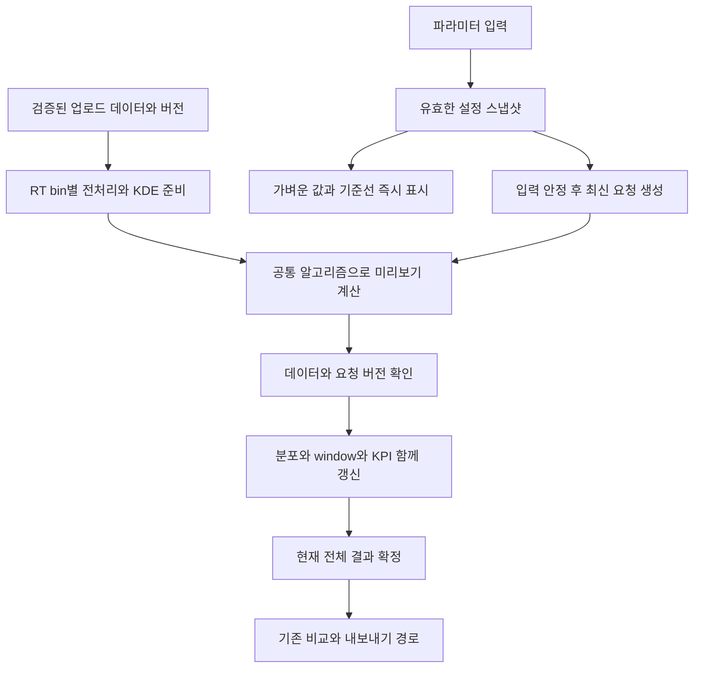

# KDE + Density 실시간 조절: 구현 가능성 검토

2026-09-10 업데이트: 슬라이더 기반 자동 미리보기, 구획별 Reset, 확정 결과 분리를 구현했다. 현재 동작·검증·제한은 [구현 기록](../reviews/2026-09-10-live-preview.md)을 참조한다. 아래 내용은 구현 전 검토이며 중간 계산 캐시 등 후속 후보도 포함한다.

2026-09-08. 결론: Shiny에서 구현 가능하다. 현재 코드의 실행 버튼 중심 계산을 설정 기반 계산으로 분리하고, 빠른 피드백과 전체 결과 계산을 단계별로 연결하는 구성을 추천한다. 이 문서는 검토이며 실제 Shiny 앱 변경은 아직 하지 않았다.

## 시작점과 사용자 요구

사용자는 자체 실험에서 KDE + Density가 가장 좋은 결과였다고 확인했다. 따라서 새 UI의 기본 전략은 `kde`, window mode는 `density`로 정한다. 이는 사용자의 실험 맥락에 근거한 시작점이다. 정확한 실험 파라미터 조합은 아직 전달되지 않았다. 현재 코드의 threshold 10%, minimum coverage 80%를 실험에서 검증된 최적 수치라고 부르지 않는다. 공개 R API의 기본값까지 변경하는 것으로 확대하지 않는다.

핵심 과제는 파라미터를 여러 방향으로 조절하면서 실제 데이터 분포와 생성되는 윈도우의 변화를 보고 원하는 조건을 찾는 것이다. 기존 제안의 3단계를 설정 요약 중심에서 **탐색과 조절 중심**으로 수정한다.

## 추천 화면

| 왼쪽: 조절 | 오른쪽: 데이터 기반 미리보기 |
|---|---|
| KDE density threshold, minimum coverage | 원본 m/z 분포 위에 threshold 선, KDE 선택 범위, 제외 영역 표시 |
| window count 자동/수동, 폭 설정 | 최종 윈도우 경계와 window별 precursor 관측치 수 |
| RT binning과 구간 선택 | 전체 RT × m/z 지도와 선택 RT 구간의 상세 분포 |
| 장비·DPPP 관련 조건 | 예상/검증된 cycle time, DPPP 충족 비율, 최종 unique coverage |
| 현재 설정을 baseline으로 고정 | baseline 대비 범위·window 폭 분포·coverage 변화 |

원본 데이터 분포는 파라미터 변경으로 변하지 않는다. 원본을 연한 고정 배경으로 남기고, **선택된 데이터의 분포·m/z 범위·최종 window·관련 지표**를 갱신한다. Density mode의 window 배치와 KDE의 범위 선택은 서로 다른 단계임을 보여준다.

기본 화면에는 KDE 두 파라미터와 RT 구간 선택을 노출한다. 사용자가 직접 조절해야 하는 핵심 변수를 모두 고급 설정에 숨기지 않는다. 숫자 입력을 slider와 함께 제공해 정확한 값을 재현하도록 한다. 슬라이더 이동 중 값·단순 기준선은 즉시 표시하고, 입력이 잠시 멈추면 실제 계산 결과를 자동 갱신한다.

## 현재 코드가 제공하는 출발점

- `inst/shiny_app/server_instrument.R`: cycle time, sync, window estimate가 이미 reactive로 구현되어 있다.
- `inst/shiny_app/server_data.R`: DPPP 미리보기가 target 설정에 반응한다.
- `inst/shiny_app/server_optimization.R`: FZ plot은 입력에 반응하지만 전략/window mode preview는 PNG 설명 이미지이며, `plan_optimization()`과 `optimize_windows()`는 `observeEvent(input$run_optimization, ...)` 안에서 호출된다. 실제 최적화 그래프의 입력은 완료된 `rv$optimized_windows`이다.
- `R/mz_optimization.R`: KDE는 RT bin별로 `density(..., bw = "SJ", n = 512)`를 구하고 실패 시 `nrd0`를 사용한다. density threshold가 peak 주변 범위를 선택하고, coverage가 부족하면 정렬된 관측치에서 최소 coverage를 만족하는 구간을 찾은 후 margin을 적용한다.
- `R/window_generation.R`: Density mode는 반복적인 경계 조정, 폭 정리, digitization/FZ 처리를 거친다. 따라서 preview에서 단순 quantile 경계를 그려 최종 window라고 표시하면 기존 알고리즘과 달라진다.
- `R/window_optimization.R`: RT binning → m/z 범위 → window 생성 → 최종 집계 → DPPP 재확인을 한 함수에서 수행한다. 이 단계들의 중간 결과를 재사용할 수 있는 분리가 성능 개선 후보이다. 현재 측정은 단계별 profiling이 아니므로 병목이라고 확정하지 않는다.

KDE threshold를 움직여도 결과가 항상 바뀌지는 않는다. minimum coverage 조건이 더 강하게 작용하거나, 최종 경계가 같은 grid로 반올림되면 같은 window가 나올 수 있다. “현재 최소 coverage 조건으로 범위가 결정됨”처럼 실제 계산 경로에서 얻은 설명을 표시하는 것이 좋다. threshold 선은 즉시 움직여도 최종 범위·coverage는 해당 설정의 계산이 끝난 뒤 갱신한다.

## Shiny 구현 방식

기본적인 입력 → `reactive()` → `renderPlot()` 연동으로 버튼 없는 자동 갱신을 구현할 수 있다. hover/brush/RT 선택도 기본 `plotOutput()` 이벤트로 연결할 수 있어 Plotly 도입은 필수가 아니다. [Reactivity overview](https://shiny.posit.co/r/articles/build/reactivity-overview/), [Interactive plots](https://shiny.posit.co/r/articles/build/plot-interaction/)

권장 계산 흐름은 다음과 같다. 아래는 설계도이며 현재 앱에 구현된 구조는 아니다.

1. **설정 수집과 계산 분리:** 버튼 handler의 입력 변환을 공통 함수로 추출한다. UI preview와 확정 계산이 동일한 config, 단위 변환, RT membership, 최종 집계 helper를 사용한다.
2. **입력 안정화:** 가벼운 설정 reactive에 약 300–500 ms `debounce()`를 시작값으로 적용한다. 무거운 계산을 debounce 앞에 넣지 않는다. 이 간격은 최소 대기이며 처리시간 보장이 아니다. 드래그 중 계속 반응해야 하는 가벼운 표시에는 throttle을 검토한다. [debounce](https://shiny.posit.co/r/reference/shiny/latest/debounce.html)
3. **의존성별 재사용:** KDE threshold/coverage 변경만으로 업로드 검증과 RT binning을 반복하지 않는다. 데이터와 binning이 같으면 KDE 곡선과 정렬된 m/z를 재사용할 수 있도록 기존 알고리즘에서 준비/선택 단계를 분리한다. RT binning 변경 시에는 해당 cache를 무효화한다. 장비·전략 변경에 따라 자동 bin 폭도 달라질 수 있으므로 실제 공통 설정의 의존성을 반영한다.
4. **캐시 범위:** 업로드 데이터는 session 범위를 기본으로 하고, 결과에 영향을 주는 설정·데이터 버전·계산 버전을 key에 포함한다. plot의 RT 선택/색상만 바뀌면 계산 결과를 재사용한다. `bindCache()`는 동기 reactive 계산에 활용하며 ExtendedTask를 자동으로 cache하는 도구로 가정하지 않는다. task 결과에는 별도 bounded session cache를 설계한다. [bindCache](https://shiny.posit.co/r/reference/shiny/latest/bindcache.html)
5. **긴 계산:** `ExtendedTask`와 `promises::future_promise()` 및 별도 R worker를 사용한다. 데이터와 설정을 인수로 전달하고 task 내부에서 live `input`/reactive를 읽지 않는다. 비동기는 UI가 멈추지 않게 하는 방법이며 계산시간을 없애지는 않는다. [Non-blocking operations](https://shiny.posit.co/r/articles/improve/nonblocking/)
6. **요청 관리:** 실행 중에는 새 요청을 계속 invoke하지 않고 최신 pending snapshot 하나만 유지한다. 완료 시 data version과 설정/request ID가 맞는 결과만 현재 결과로 게시한다. plot과 KPI는 한 결과 묶음에서 갱신한다. 새 데이터 업로드, 오류, 설정 되돌리기도 같은 규칙을 적용한다. R ExtendedTask는 추가 invoke를 순서대로 queue하므로 이 제어가 앱에 필요하다. [ExtendedTask](https://shiny.posit.co/r/reference/shiny/latest/extendedtask.html)

RT 한 구간만 계산한 preview라면 해당 구간의 지표임을 명시한다. 전 구간 unique coverage로 표시하지 않는다. 먼저 전체 데이터를 사용하는 정확 계산과 cache를 검토하고, 측정상 필요할 때만 표시용 집계 축소/부분 구간 preview를 추가한다. 샘플링으로 얻은 window를 전체 결과인 것처럼 사용하지 않는다.

현재 입력과 일치하는 전체 계산 결과가 준비되면 “이 설정으로 결과 확정”으로 데이터·plan·windows·모든 전략 설정을 묶어 보존한다. preview와 완료 결과의 저장 위치를 분리하고, preview 갱신이 기존 PDF/CSV/ZIP의 기준을 덮어쓰지 않게 한다. 최근 `86c9c4b`의 비교 설정 보존, unique accounting, 공통 delivery를 그대로 이어간다.

## 합성 데이터 성능 측정

실행 환경: Windows, R 4.5.2. `devtools::load_all(".")`로 이 worktree의 코드를 로드했다. 코드 기준은 `86c9c4b`이며 앱/알고리즘 소스는 수정하지 않았다. 재현 스크립트: [benchmark_shiny_preview.R](../../scripts/benchmark_shiny_preview.R).

합성 데이터는 seed 20260908, m/z가 400 + 700 × Beta(2,4), RT가 0–60분 균등분포, FWHM 4초이다. 고정 5분 bin, cycle당 40 windows, min/max width 2/80, FZ 0.25, KDE + Density를 사용했다. 각 설정은 연속 3회 실행했으며 별도 앱 cache는 없다. 아래 시간은 중앙값이며 각 결과는 총 480 window 행을 생성했다.

| 관측치 수 | threshold | minimum coverage | Stage 3 중앙값 | 3회 최소–최대 |
|---|---|---|---|---|
| 10,000 | 10% | 80% | 0.69초 | 0.41–0.72초 |
| 10,000 | 20% | 80% | 0.32초 | 0.30–0.37초 |
| 10,000 | 10% | 90% | 0.50초 | 0.44–0.52초 |
| 100,000 | 10% | 80% | 2.07초 | 1.95–2.15초 |
| 100,000 | 20% | 80% | 0.92초 | 0.83–1.00초 |
| 100,000 | 10% | 90% | 2.07초 | 1.75–2.25초 |

이 측정은 test fixture 형식의 단순 plan을 사용한 `optimize_windows()` 계산만 포함한다. 업로드·검증·Stage 2 planning·그래프·브라우저·worker 전송·다중 사용자 경쟁·PDF/다중 전략 비교는 제외한다. 사용자의 실험 데이터, adaptive RT binning, 여러 peak 분포에서의 속도를 보장하지 않는다. 패키지 로드 시간도 제외했다. 실행 시 Windows locale 경고와 testthat 빌드 버전 경고가 있었으며 스크립트는 정상 완료했다.

해석: 적어도 이 합성 조건에서는 초 단위 전체 preview가 가능하다. 매 입력마다 전체 계산을 동기 실행하기보다 단순 표시를 즉시 갱신하고 전체 계산은 자동으로 백그라운드 처리할 근거가 된다. drag frame마다 모든 window를 정확하게 다시 계산할 수 있다는 근거는 아니다.

## 의존성과 다음 검증

- 현재 로컬 설치 확인: Shiny 1.13.0, promises 1.5.0, future 1.75.0. 설치된 aidia 0.4.0 대신 worktree 소스를 측정했다.
- 저장소는 `shiny (>= 1.7.0)`이므로 ExtendedTask 채택 시 최소 버전을 1.8.1 이상으로 올리고 promises/future 직접 의존성을 선언한다. [Shiny 1.8.1 발표](https://opensource.posit.co/blog/2024-03-27_shiny-r-1.8.1/)
- Windows worker에도 동일한 worktree 코드와 필요한 패키지가 로드되는지 검증한다. 큰 데이터 전송·메모리 복제 비용, worker 수와 session 종료 처리를 측정한다. worker 전략은 앱/배포 시작 시 결정하고 slider 이벤트마다 바꾸지 않는다.
- 실제 실험 report와 최적 KDE 파라미터로 Stage 2/3 및 주요 plot의 시간을 나누어 측정한다. 합성 데이터는 해당 실험의 최적값을 검증하지 않는다.
- 통합 검증: 연속 조절 시 오래된 결과 무시, 최신 pending 1개 유지, parameter A→B→A cache 재사용, 업로드 교체 중 계산 완료, invalid 입력과 오류 복구, 확정 순간 설정 변경, plot/KPI/export 일치.
- 성능 목표는 단순 피드백 즉시 표시, 정확한 전체 preview는 계산 중 조절 가능한 상태로 자동 갱신하는 것이다. 전체 preview 지연 목표는 실제 데이터 측정 후 정한다.

세부 API 근거는 [공식 문서 검토 노트](2026-09-08-shiny-reactivity-official-notes.md)에 모았다. 실제 UI 구현·브라우저 사용성 검증은 아직 수행하지 않았다.
