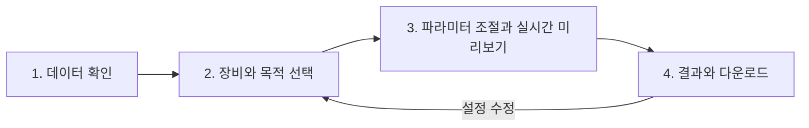

# Shiny workflow UX 개선 제안

2026-09-10 최신 상태: 세 구획으로 구성한 compact 화면에 슬라이더 기반 자동 미리보기·구획별 Reset·확정 결과 보존을 구현했다. 최신 동작과 검증은 [미리보기 구현 기록](../reviews/2026-09-10-live-preview.md)을 참조한다. 아래 제안 및 1차 진행 내용은 변경 이력이다.

작성일: 2026-09-08. 상태: 제안 및 작업 기반 준비 완료, 앱 구현 전.

2026-09-10 진행: 사용자 요청에 따라 UI 배치·문구·도움말·색상·다운로드 위치·KDE 기본 선택에 한정한 1차 변경을 구현했다. 실시간 계산과 상태 구조 개선은 후속 단계로 유지한다. 구현 범위와 검증, 변경 전후 화면은 [UI 1차 변경](../reviews/2026-09-10-ui-first-pass.md)에 기록한다.

사용자 피드백 반영: 실험에서 가장 좋은 결과를 얻은 **KDE + Density**를 새 UI의 시작점으로 삼는다. 단순 설정 확인 화면을 **파라미터 조절과 실시간 미리보기 화면**으로 확장한다. 실제 실험에 사용한 세부 파라미터는 아직 전달받지 않았으므로 코드의 KDE 기본 수치와 구분한다. 기술 검토와 측정 한계는 [실시간 미리보기 검토](2026-09-08-shiny-live-preview-feasibility.md)에 기록한다.

실제 화면 검토 후 보완: 아래 네 작업은 논리적 순서이며 반복 조절 때마다 거치는 고정 wizard로 만들지 않는다. 상위 탐색은 **준비 → 탐색 → 내보내기**로 묶고, 준비 안에서 데이터·장비를 안내한 뒤 파라미터·그래프·baseline 비교를 한 화면에서 반복하도록 한다. 실제 화면, 판정 메시지 혼재, 1024px 배치와 우선순위는 [UX 디자인 검토](../reviews/2026-09-08-shiny-ux-design-review.md)를 따른다.

## 목표와 검토 범위

처음 사용하는 연구자가 데이터 업로드부터 장비용 method 다운로드까지 도움 없이 진행하고, 선택한 설정과 결과의 의미를 설명할 수 있게 한다. 계산 기능을 유지하면서 의사결정 순서, 정보량, 상태 표시를 재구성한다.

이 문서는 현재 UI/server 소스와 로컬 Git 이력 검토에 근거한다. 실제 브라우저 사용성 평가나 R 실행 검증 결과는 아니다. 사용성 문제는 소스에서 도출한 가설이며, 아래 사용자 과제로 검증한다.

## 현재 구성에서 발견한 개선 지점

| 현재 위치 | 관찰 | 개선 방향 |
|---|---|---|
| `inst/shiny_app/ui_step1_data.R` | 업로드 옆에 장비, resolution, IT, window count가 바로 노출되고 이후 DPPP와 cycle time 상세가 이어진다. | 첫 화면은 파일 선택과 데이터 확인에 집중한다. 장비 설정과 목표 선택은 다음 화면에 배치한다. |
| `inst/shiny_app/ui_step2_setup.R` | DPPP 또는 Acquisition Sync 다음에 전략, window mode, RT binning이 이어진다. Expert Settings와 추가 옵션 접기는 이미 존재한다. | 기존 접기를 확장해 기본 경로에서 결정할 항목을 줄인다. 목표와 전략의 관계를 설명한다. |
| `inst/shiny_app/ui_step2_setup.R` | `ID`, `Bal`, `Quant`, `Target Satisfaction` 등 해석이 필요한 명칭이 있다. | 목적과 의미를 먼저 쓰고 전문 용어와 수치를 병기한다. |
| `inst/shiny_app/ui_step3_results.R` | KPI, capacity diagnostics, 요약, 큰 그래프들을 지나야 다운로드가 보인다. | 결과 요약 바로 다음에 method 다운로드를 배치하고 진단은 별도 탭으로 이동한다. |
| `inst/shiny_app/app.R` | 이동과 초기화가 여러 이벤트와 boolean 상태에 연결된다. | 단계별 진입 조건과 완료/수정/실패 상태를 명시하고 UI와 서버가 같은 조건을 사용한다. |
| `inst/shiny_app/server_optimization.R`, `server_downloads.R` | 최근 수정으로 실행 시점의 전략 설정과 완료 결과를 비교·다운로드에 활용한다. | 현재 편집 중인 설정과 완료 결과에 사용된 설정을 화면에서 구분한다. |

## 추천 화면 구조

단계 수 자체보다 각 화면에서 답할 질문 하나와 주 행동 하나를 명확히 하는 것이 핵심이다. 아래 명칭은 설명용 한국어이며, 구현 시 기존 영어 UI의 용어와 문체를 일관되게 정리한다. 다국어 지원은 별도 범위로 둔다.

### 1. 데이터 확인 — 어떤 데이터를 사용할 것인가?

- `DIA-NN report.parquet` 업로드, 지원 파일 설명, 파일 검증 상태를 중심으로 구성한다.
- 업로드 후 파일명, 분석에 사용하는 precursor 관측치 수, RT 범위, peak width 요약을 보여준다. 원본 행 수와 검증 후 관측치 수가 다르면 구분한다.
- 입력 오류는 업로드 영역에 원인과 해결 방법을 지속 표시한다. 사라지는 알림만으로 설명하지 않는다.
- 기본 경로에서 peak width 그래프와 데이터 상세 표는 접는다. 다음 버튼에는 이동 대상과 준비 조건을 표시한다.
- 예제 체험은 작은 비민감 fixture의 준비·검증 후 추가할 후속 기능으로 둔다. 실제 사용자 데이터를 예제에 포함하지 않는다.
- 데이터는 결과 기반 입력이라는 `docs/adr/0004-result-driven-input-no-raw-file.md`의 결정을 따른다. raw/method 업로드나 파일 기반 장비 자동 추정은 추가하지 않는다.

### 2. 장비와 목적 선택 — 어떤 조건으로 최적화할 것인가?

- 장비 선택과 핵심 acquisition 조건 확인을 먼저 배치한다. 기본값이 실제 장비 설정과 같다는 가정은 하지 않으며 사용한 값을 보여준다.
- 목적 선택은 기존 ID / Balanced / Quant 프리셋에 설명을 붙인 카드로 제공한다. 기존 수치 1.5 / 4.0 / 7.0과 기본 선택 7.0을 먼저 유지한다. 이는 현재 설정 프리셋이며, 실험 성능을 보장한다는 표현은 사용하지 않는다.
- `DPPP`는 “피크 전체에서 확보할 측정점 수”, `Target Satisfaction`은 “목표 측정점 수를 충족할 피크의 목표 비율”처럼 의미를 먼저 설명한다. 수식과 정확한 정의는 상세 도움말로 제공한다.
- Astral 계열은 기존 sync 중심 계산과 설명을 유지한다. 목적 카드가 sync-optimal window count를 직접 결정하는 것처럼 표시하지 않는다. 실제 계산된 제약과 DPPP 확인 결과를 보여준다.
- 현재 방법의 MS2 window count와 최적화가 생성할 window count를 다른 항목으로 명확히 구분한다.
- 요약 카드에는 사용 조건과 예상 결과를 표시하고, “예상”이라는 표기를 완료 결과와 구분한다. 공식 계산 helper를 재사용한다.

### 3. 파라미터 조절과 실시간 미리보기 — 어떤 설정이 원하는 조건을 만드는가?

- 기본 경로는 사용자 실험에서 가장 좋은 결과를 얻은 KDE + Density를 시작점으로 제공하고 적용 설정을 요약한다. 현재 앱 코드의 기본 선택은 Greedy이므로 UI 구현 시 KDE로 변경한다. 패키지 API의 기본값 변경은 별도 범위이며, 모든 데이터에서 최선이라는 표현은 사용하지 않는다.
- 왼쪽은 파라미터 조절, 오른쪽은 실제 입력 데이터의 m/z 분포, 선택 범위, 생성된 window 경계와 coverage를 보여준다. KDE threshold와 minimum coverage는 기본 화면에 노출한다.
- 파라미터 변경 후 자동 갱신한다. 짧은 입력 대기(debounce), 단계별 계산 재사용, 무거운 계산의 백그라운드 실행으로 연속 조절을 지원한다. 계산 중에는 마지막 완료 미리보기를 유지하고 현재 입력과 일치하는지 표시한다.
- RT 구간 선택과 baseline 대비 변경 보기를 제공한다. 원본 분포와 선택 후 분포를 구분하고, 근사 preview와 전체 데이터 계산의 적용 범위를 표시한다.
- “세부 설정”에서 기존 5개 전략, 3개 window mode, RT binning, smoothing, FZ offset, 장비별 추가 설정에 접근한다.
- 기본/상세 전환은 같은 설정을 다른 깊이로 보여주는 방식으로 만든다. 전환만으로 사용자 값을 초기화하지 않는다. 프리셋 재적용은 별도 명시적 동작으로 둔다.
- 실행 전 요약에 파일, 장비 조건, 목표, 전략, window mode, RT binning, 사용자가 변경한 설정을 보여준다. 각 영역에 수정 링크를 둔다.
- 주 버튼은 “이 설정으로 결과 확정”으로 구성한다. 미리보기는 자동 계산하며, 현재 데이터와 설정에 정확히 일치하는 전체 계산 결과를 검증한 후 확정한다. 최신 결과가 아직 없으면 완료를 기다리거나 정확 계산을 실행하며 이전 결과를 확정하지 않는다. 측정 근거 없는 진행률이나 남은 시간은 표시하지 않는다.

### 4. 결과와 다운로드 — 무엇이 생성되었고 다음 행동은 무엇인가?

- 첫 영역은 완료 결과의 장비·전략·실행 시점, 주요 수치, 조치가 필요한 메시지로 구성한다.
- 이어서 method 형식 선택과 다운로드를 배치한다. PDF와 전체 형식 ZIP은 보조 행동으로 제공한다.
- cycle time, DPPP 충족, 최종 window 기반 unique coverage 등의 값을 의미와 함께 보여준다. coverage를 실제 동정률 향상으로 표현하지 않는다.
- cycle당 window 수, RT 구간 전체의 총 window 행 수, staggered의 Loop N을 구분한다.
- 결과 하위 탭은 `요약`, `진단 그래프`, `윈도우 표`로 구성한다. 기존 시각화와 detailed table에 계속 접근할 수 있게 한다.
- capacity의 available headroom은 정보로 표시한다. 남는 capacity만으로 경고색이나 결함 판정을 부여하지 않는다.
- 설정 수정 후에는 “설정이 변경되었습니다. 이 결과와 다운로드는 이전 실행 조건을 사용합니다”라는 배너와 재실행 동작을 제공한다.
- export format, void fill, acquisition bounds는 기존 정의대로 내보내기 옵션이다. 최적화 설정 변경과 분리하고 선택값을 다운로드 전에 표시한다.

## 상태와 접근성

- 공통 단계 표시줄에 현재 단계, 완료 단계, 진행 불가 이유를 표시한다. 이전 단계 수정은 허용한다.
- `데이터 없음 → 검증 중 → 설정 가능 → 실행 중 → 결과 있음` 상태에 오류/재시도와 설정 변경 여부를 결합한다. 실제 구현은 기존 reactive 구조와의 연결을 먼저 정리한다.
- 결과를 유지하면서 설정을 편집할 경우, 실행 시점의 데이터·plan·windows 묶음이 일치해야 한다. 새 파일을 업로드하면 기존 결과의 사용을 중단하는 현재 정책을 유지한다.
- 분석 초기화는 완료 결과를 잃는 동작임을 알 수 있게 명명한다. 입력 초기화와 결과 초기화의 범위를 정의한다.
- 비활성 버튼에는 이유를 표시하고, 서버에서도 같은 준비 조건을 검사한다. 브라우저에서 탭을 직접 전환해도 조건을 우회할 수 없어야 한다.
- 키보드 포커스, 화면 전환 후 제목 포커스, 상태의 텍스트 표현, 좁은 화면에서의 줄바꿈을 포함한다. 색상과 hover tooltip만으로 정보를 전달하지 않는다.

## 기존 커밋과 연계

- 부모 브랜치: `Hayoung-hiro/AIDIA-main`.
- 기준 커밋: `86c9c4ba9769b59dd8f863f8a3e9fc12fcd9bbce` (`fix: preserve comparison settings and unify accounting and exports`).
- 새 브랜치: `Hayoung-hiro/shiny-workflow-ux`.
- 새 worktree: `C:/Users/Hayoung/orca/workspaces/aidia/shiny-workflow-ux`.
- Orca에서도 원래 worktree의 자식으로 등록했다. 생성 직후 HEAD가 기준 커밋과 같음을 확인했다.
- 기준 커밋의 모든 조상(최근 density 방향 독립성 및 Stage 3 개선 포함)을 이어받는다. 이미 포함된 커밋은 다시 cherry-pick하지 않는다.
- `build_strategy_comparison()`과 실행 시점 설정 캡처를 유지한다. 숨겨진 전략의 사용자 설정도 비교에 반영되는 계약을 보존한다.
- 최종 window와 명시적 RT membership을 사용한 precursor accounting을 UI에서 다시 구현하지 않는다. 중첩 window의 개별 count와 전체 unique coverage를 구분한다.
- `format_result_filename()`, `export_method_formats()`, `export_method_bundle()` 등 공통 delivery 경로를 재사용한다.
- 원래 worktree의 스테이징된 6개 파일은 새 worktree로 복사하지 않았다: `R/plot_fz_zoom.R`, `docs/domain-knowledge.md`, `tests/manual/test_forbidden_zone.R`, FZ 관련 설계/계획 문서 2개, Exploris LFQ benchmark 설계 문서 1개. 이 작업들은 원래 위치에 그대로 있다.
- 최종 확인 시 부모 worktree에는 추가 미스테이징 변경과 새 문서·테스트 파일도 관찰되었다. 위 6개는 최초 확인 시점의 스테이징 목록이다. 진행 중인 부모 작업은 수정하지 않았으며, 실제 통합 시 최신 변경 목록과 커밋을 다시 확인한다.
- 해당 변경이 부모 브랜치에서 커밋되면 새 브랜치에서 부모 브랜치를 병합해 통합 검증한다. 재현성 기준은 병합 전후로 기록한다.
- PR은 부모 변경의 main 반영 여부를 보고 base를 결정한다. 부모가 미반영이면 부모 브랜치 대상의 stacked PR, 반영되면 main 대상 PR로 구성한다.

## 구현 순서와 커밋 경계 제안

아래는 예정 단위이며 아직 구현하거나 커밋한 내역이 아니다.

| 순서 | 변경 단위 | 완료 조건 |
|---|---|---|
| 1 | UX 명세와 화면 모형 | 네 단계의 기본/상세 경로, 실패와 설정 수정 상태를 모형에서 검토한다. |
| 2 | 공통 workflow 상태와 이동 | 진입 조건, 재실행, 업로드 실패, 초기화가 UI와 서버에서 일치한다. |
| 3 | 데이터·장비·목적 화면 | 새 입력 ID 중복 없이 기존 설정값과 장비별 계산이 보존된다. |
| 4 | KDE + Density 조절·실시간 미리보기·확정 | 파라미터별 영향이 자동 표시되고 늦게 끝난 과거 계산이 최신 미리보기를 덮어쓰지 않는다. 기존 모든 옵션에 접근하며 설정을 보존한다. |
| 5 | 결과·다운로드 구성 | 완료 설정 표시, 변경 배너, 상단 다운로드와 진단 탭이 동작한다. |
| 6 | 통합 검증·사용성 보정 | 회귀 검사와 사용자 과제로 확인한 문제를 수정하고 사용 안내를 갱신한다. |

초기 구현은 기존 bs4Dash 기반에서 진행하는 안을 추천한다. 화면 재구성과 Bootstrap/bslib 마이그레이션은 변경 영향이 다르므로, 프레임워크 교체가 필요하다는 근거가 생기면 별도 결정으로 다룬다. 상세 정보의 탭·접기 구성은 Shiny 공식 문서에서도 제공하는 패턴이다: [Tabs and tabset panels](https://shiny.posit.co/r/getstarted/build-an-app/customizing-ui/tabs.html), [Tabs and accordions](https://shiny.posit.co/r/layouts/tabs/). 이 자료는 UI 패턴의 구현 가능성에 대한 참고이며, 제안의 사용성 효과를 검증한 근거는 아니다.

## 검증 계획

- 계산 계약: `test-strategy-comparison.R`, `test-final-window-accounting.R`, `test-method-delivery.R`, `test_s3_contracts.R`를 유지하고 변경 범위에 맞게 실행한다. 계산 경로를 건드렸다면 관련 density/Stage 3 회귀도 실행한다.
- UI 상태: 데이터 없이 이동, 업로드 실패 후 재시도, 반복 실행, 완료 후 설정 변경, 다른 파일 업로드, 새 분석을 검증한다. 필요한 상태 검사는 Shiny server 수준의 테스트로 추가한다.
- 설정 보존: hidden controls, 기본/상세 전환, 프리셋 적용, 뒤로 이동 후 재실행에서 의도치 않은 값 초기화가 없는지 확인한다.
- 실시간 미리보기: 빠른 연속 입력, 계산 중 업로드 교체, 실패와 재시도, session 종료, 이전 요청의 늦은 완료를 검증한다. plot·KPI·확정 결과의 데이터 및 설정 버전이 일치해야 한다.
- 결과 일관성: 실행 후 화면의 전략·장비를 변경해도 기존 결과의 이름, 비교 설정, method/PDF/ZIP이 원래 실행에 연결되는지 확인한다. 내보내기 전용 설정은 의도대로 반영되는지 확인한다.
- 같은 검증 입력과 설정에 대해 최종 window와 핵심 수치를 기존 기준과 비교한다. 실행 환경의 aidia가 설치본인지 해당 worktree 소스인지 확인하고 worktree 코드를 검증한다.
- 브라우저 과제: 업로드 → 목표 선택 → 실행 → method 다운로드; 설정 변경 후 재실행; 진단에서 원인 확인; 잘못된 파일에서 복구. Astral과 sequential 장비 경로를 모두 확인한다.
- 사용성 평가: 처음 쓰는 연구자 3–5명이 설명 없이 과제를 수행하도록 하고 완료율, 도움 요청 횟수, 잘못된 이동, 다운로드까지 시간, 결과 해석 오류를 기록한다. 목표는 다섯 명 평가 시 네 명 이상 독립 완료로 설정하되 초기 표본의 방향성 지표로 취급한다. 속도 개선은 현재 UI와 같은 데이터·환경에서 비교한다.

## 이번 준비 작업의 결과

새 worktree 생성과 기준 커밋 확인, 소스 기반 검토, 이 제안서 작성을 완료했다. 후속 검토에서 합성 데이터 계산 측정과 실제 Shiny UI 실행·화면 검토도 수행했다. 앱 동작은 변경하지 않았고 새 커밋은 만들지 않았다. 사용자 대상 사용성 테스트는 아직 수행하지 않았다.
