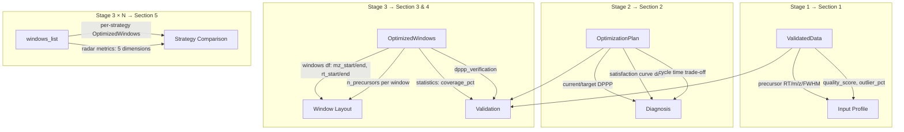

# AIDIA Reporting System Redesign Plan

## Context

AIDIA's current reporting system (Stage 4) generates **30+ plots** but suffers from significant redundancy. There are 4 DPPP plot variants, 3 width distribution formats (ridge/box/CDF), overlapping window layout views, and RT histograms that duplicate the heatmap's marginal axis. The PDF report already filters to a subset, but the selection lacks a principled framework.

This plan restructures reporting around a **5-section narrative** — each section answers one user question with the minimum non-redundant data needed for decision-making.

---

## Report Data Architecture

The report tells a story: **Input → Diagnosis → Solution → Validation → Comparison**

```
┌─────────────────────────────────────────────────────────┐
│                    REPORT NARRATIVE                       │
├──────────────┬──────────────────────────────────────────┤
│  Section     │  User Question                           │
├──────────────┼──────────────────────────────────────────┤
│ 1. Input     │ "Is my data suitable for optimization?"  │
│ 2. Diagnosis │ "What's wrong with current acquisition?" │
│ 3. Result    │ "What did AIDIA produce?"                │
│ 4. Validation│ "Did optimization actually improve?"     │
│ 5. Comparison│ "Which strategy fits my use case?"       │
└──────────────┴──────────────────────────────────────────┘
```

### Section 1: Input Data Profile
**Purpose**: Characterize the precursor landscape and chromatographic quality.

| Metric/Visual | Source | Why Not Redundant |
|---|---|---|
| **RT × m/z Density Heatmap** | `plot_rt_mz_density_heatmap()` | Only 2D spatial view of precursor distribution |
| **FWHM Distribution** | `plot_fwhm_distribution()` | Sole indicator of chromatographic peak quality; drives DPPP formula |
| **Data Quality Score** | `validate_data_quality()` | Compact QC summary (outlier %, RT/m/z validity) — currently computed in Stage 1 but **not rendered in the report** |

**Removed (redundant)**:
- RT histograms (`plot2b_*`) — marginal projection of the heatmap's Y-axis, adds no new information
- Charge state × m/z (`plot19`) — interesting but not actionable for window optimization; move to appendix only

### Section 2: Acquisition Diagnosis
**Purpose**: Show why the current acquisition parameters are suboptimal and what the target is.

| Metric/Visual | Source | Why Not Redundant |
|---|---|---|
| **DPPP Diagnosis Table** | `plot_dppp_diagnosis_table()` | Single consolidated view: current vs target DPPP, satisfaction %, cycle time — replaces all 4 DPPP plot variants |
| **Satisfaction vs Cycle Time Curve** | `plot_satisfaction_curve()` (exists but **not currently in PDF**) | Shows the *trade-off space* — the only view that answers "how much cycle time do I need for X% satisfaction?" |

**Removed (redundant)**:
- `plot1a_dppp_comparison_simple` — subset of diagnosis table
- `plot1b_dppp_enhanced` — legacy curve, superseded by satisfaction curve
- `plot1b_dppp_satisfaction_combined` — merged legacy version
- `plot15_dppp_distribution` — per-precursor histogram, already summarized as satisfaction % in diagnosis table

### Section 3: Optimized Window Layout
**Purpose**: Present the window design result — where boundaries are and how precursors distribute.

| Metric/Visual | Source | Why Not Redundant |
|---|---|---|
| **Tiling Coverage Map** | `plot_tiling_coverage_map()` | Only true "window map" — shows actual isolation tiles on RT × m/z plane |
| **Precursor Load Balance** | `plot_precursor_load_balance()` | Unique metric: are precursors evenly distributed across windows? (CV-based) |
| **m/z Density with Boundaries** | `plot_mz_normalized_density()` | Shows how window boundaries align with density peaks per RT segment |

**Removed (redundant)**:
- `plot2c_heatmap_with_mz_range` — 2×2 grid of all strategies; belongs in Section 5 (comparison), not single-strategy result
- `plot13_alignment_density` — overlaps with tiling coverage map (both show precursor-window spatial alignment)

### Section 4: Optimization Validation
**Purpose**: Prove the optimization improved acquisition quality. Before/After evidence.

| Metric/Visual | Source | Why Not Redundant |
|---|---|---|
| **Before/After Impact Dashboard** | `plot_optimization_impact()` | Only before/after comparison: cycle time, satisfaction, window count |
| **Edge Proximity Distribution** | `plot_edge_proximity()` | Unique safety metric: how close are precursors to window boundaries (fragmentation quality risk) |
| **Forbidden Zone Zoom** *(conditional)* | `plot_fz_zoom()` | Only FZ-specific view; only shown when FZ offset > 0 |

**New addition**: Add **coverage delta** (before coverage estimate vs after) to the impact dashboard. Currently the dashboard shows cycle time and satisfaction before/after but lacks a coverage metric.

### Section 5: Strategy Comparison *(conditional: ≥ 2 strategies)*
**Purpose**: Help users choose between strategies by showing trade-offs across quality dimensions.

| Metric/Visual | Source | Why Not Redundant |
|---|---|---|
| **Strategy Comparison Table** | `plot_strategy_comparison_table()` | Compact numerical summary: coverage, width, windows, utilization style |
| **Radar Chart** | `plot_strategy_radar()` | Multi-dimensional shape comparison (5 axes: coverage, load balance, width uniformity, edge safety, compactness) |
| **Heatmap + Boundary Grid** | `plot_density_with_mz_ranges_grid()` | Side-by-side spatial view of how each strategy places boundaries on the density landscape |

**Removed (redundant)**:
- Ridge plot (`plot8a`) — width distribution shape; already captured numerically in table + visually in radar's "width uniformity" axis
- Box plot (`plot8b`) — statistical summary of width; redundant with table
- CDF plot (`plot8c`) — cumulative width distribution; redundant with table
- Width profile overlay (`plot5`) — line chart of width per RT bin; difficult to interpret with 5 overlapping lines
- Strategy boundary comparison (`plot5b`) — legacy faceted view, superseded by grid heatmap

---

## Data Inventory: What Goes Into Each Section



## Summary: Plot Count Reduction

| Section | Current Plots | Proposed Plots | Removed |
|---|---|---|---|
| Input Profile | 5 (heatmap, FWHM, 2×RT hist, charge) | 2 + 1 new metric | RT histograms, charge→appendix |
| Diagnosis | 5 (4×DPPP variants, distribution) | 2 | 3 legacy DPPP, distribution |
| Window Layout | 4 (tiling, alignment, density, grid) | 3 | alignment (overlap w/ tiling) |
| Validation | 3 (impact, edge, FZ) | 3 | none |
| Strategy Comparison | 8 (table, radar, ridge, box, CDF, width profile, boundary, grid) | 3 | ridge, box, CDF, width profile, boundary |
| **Per-Strategy Appendix** | ~15 (3 per strategy × 5) | keep as-is | — |
| **Total PDF pages** | ~25-30 | ~15-18 | ~40% reduction |

---

## Implementation Plan

### Step 1: Add Data Quality Score rendering to Section 1
- **File**: `R/export_plots.R` — new helper `.draw_data_quality_summary()`
- **Data**: Reuse `validated_data$validation_status$quality_score` and `validation_status$warnings` from Stage 1
- No new computation needed — data already exists in `ValidatedData` S3 object

### Step 2: Add Satisfaction Curve to Section 2
- **File**: `R/export_plots.R` → `create_pdf_report()` — add `plot_satisfaction_curve()` to Section 2's plot keys
- `plot_satisfaction_curve()` already exists in `R/plot_satisfaction.R` but is **not generated** by `generate_visualizations()`
- **File**: `R/visualization.R` → `generate_visualizations()` — add satisfaction curve to the plots list

### Step 3: Restructure PDF sections in `create_pdf_report()`
- **File**: `R/export_plots.R` — rewrite section emission logic to match the 5-section narrative
- Move `plot2c_heatmap_with_mz_range` from Section 3 to Section 5
- Remove ridge/box/CDF from Section 5
- Add satisfaction curve to Section 2

### Step 4: Prune redundant plot generation (optional, performance)
- **File**: `R/visualization.R` → `generate_visualizations()` — stop generating plots that are never used in PDF or Shiny
- Candidates: `plot1a`, `plot1b_dppp_enhanced`, `plot1b_dppp_satisfaction_combined`, `plot2b_*`, `plot5b`, `plot8b`, `plot8c`
- Keep them available via `create_individual_plots = TRUE` for power users, but skip when only PDF is needed

### Step 5: Update Shiny Step 3 results to match report narrative
- **File**: `inst/shiny_app/ui_step3_results.R` — ensure Shiny results tab mirrors the same data hierarchy
- No structural changes needed — Shiny already shows KPIs + before/after + detail tables

---

## Verification

1. **Unit tests**: `devtools::test()` — existing tests should pass (no API changes)
2. **PDF report**: Run `source("tests/manual/test_full_pipeline.R")` — verify PDF generates with new section structure
3. **Visual check**: Open generated PDF, confirm:
   - 5 clear sections with divider pages
   - No duplicate information across sections
   - Satisfaction curve appears in Section 2
   - Data quality score appears in Section 1
4. **Shiny**: `aidia::run_aidia_app()` — verify Step 3 results still render correctly

---

## Key Files to Modify

| File | Change |
|---|---|
| `R/visualization.R` | Add satisfaction curve to plots list; optionally skip redundant plots |
| `R/export_plots.R` | Restructure `create_pdf_report()` sections; add `.draw_data_quality_summary()` |
| `R/plot_satisfaction.R` | No changes — already exists |
| `R/quality_validation.R` | No changes — quality score already computed |
