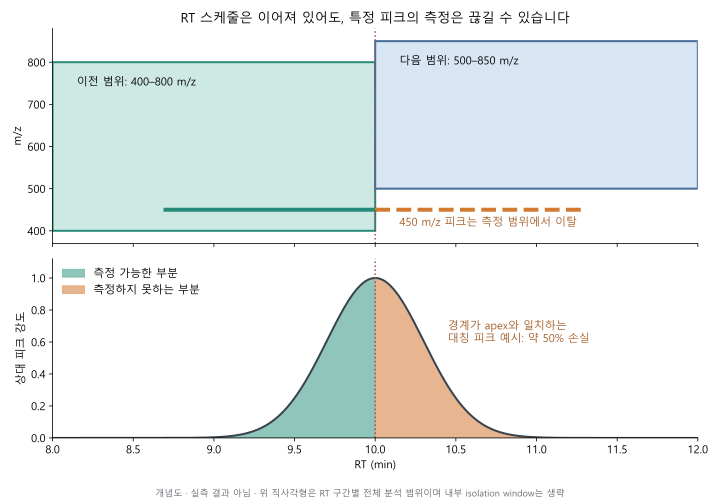

# RT 분할: 사실 검토와 설계·검증 제안

2026-09-08. 대상은 **동일 배치의 유사 시료에서 얻는 대표 분석 범위**다.
실험 그룹 선택 기능은 추가하지 않는다. 아래 알고리즘은 제안이며 구현·검증이
완료된 새 최적화 방법으로 표현하지 않는다. 문헌 근거는 [별도 기록](2026-09-08-rt-partition-evidence.md)에 모았다.

논문용 현재 버전 보존과 Global 재설계의 구체적 목적함수는
[2026-09-10 별도 브랜치 설계안](2026-09-10-global-domain-v2-design.md)에 정리했다.
해당 문서는 구현 전 제안이며 현재 알고리즘을 설명하는 자료로 인용하지 않는다.

## 2026-09-10 후속 논의 — 목표와 우선순위 정정

사용자는 기존 경계 손실 검토에서 손실이 크지 않았다고 설명했다. 이 결과를
기존 경험적 근거로 반영하되 수치·자료·평가 범위는 이번에 재확인하지 못했다.
앞선 피크 잘림 예시는 가능한 현상을 설명한 것이며 현재 자료의 지배적 문제라는
증거가 아니다. 아래의 '평가기부터 새로 구축' 권고를 최우선 작업으로 고정하지 않는다.

**현재 논의의 중심은 유효 m/z 범위의 시간 변화를 재현성 있게 근사하는 것이다.**
사용자의 추가 설명에 따라 CSV 행 수는 최적화 함수의 주요 벌점으로 사용하지 않는다.
현재 staggered 처리에서는 bin별 mzML 변환과 demultiplexing이 필요하므로, 성능이
유사한 후보 중 작은 K를 선호하는 보조 기준으로 사용한다. 경계 손실은 기존 결과를
기준으로 악화되지 않는지 확인하는 수락 조건으로 둔다.

### 추가 확인: Global 명칭과 smoothing의 실제 역할

- 사용자는 지금까지 Greedy와 KDE 등 Global 전략 검증에 집중했다고 설명했다.
  이후 실험의 우선 대상도 이 두 전략으로 둔다.
- README는 Global을 continuous function으로 설명하지만, 현재
  `optimize_mz_ranges.greedy_config()`와 `optimize_mz_ranges.kde_config()`는
  모두 `rt_group`별로 자료를 나눠 각각 계산한다. Greedy는 각 bin에서 고정 폭의
  범위에 들어오는 전구체 수를 최대화하고, KDE는 각 bin의 1차원 m/z 밀도에서
  주봉 주변 범위를 정한다. 현재 구현을 전체 RT–m/z 분포의 공동 최적화로
  설명할 수 없다. 이 불일치의 발생 시점이나 기존 실험 영향은 아직 확인하지 않았다.
- Greedy의 선택적 smoothing은 bin별 하한·상한의 흔들림을 줄인다. WH는 원래
  경계와의 가중 제곱 차이와 2차 차분 벌점 사이의 절충이며, 가중치는
  `sqrt(n_precursors_covered)`다. 전구체 coverage를 직접 최대화하는 목적함수가
  아니다. 이후 coverage를 다시 계산하지만 감소 자체를 되돌리는 조건은 없다.
- KDE의 밀도 smoothing은 m/z 축 안에서 일어난다. 별도 RT 경계 smoothing은
  no-op이다. 따라서 코드 주석의 'inherently smooth boundaries'를 RT 방향까지
  연속적이라는 의미로 해석하면 안 된다.

### 추가 제안: optimal K의 선택 규칙

아래는 아직 구현하지 않은 설계 제안이다.

1. 최소 K=1을 포함하고, 모든 후보에서 cycle time과 cycle당 창 수를 고정한다.
   bin마다 완전한 cycle 하나를 요구하는 단순 모델의 상한은 floor(T/C)다.
   이는 실제 장비 상한이 확정되었다는 뜻이 아니다. Staggered의 완전한 반복
   패턴 길이 P와 demultiplexing에 필요한 반복 수 r을 요구하면 최소 bin 길이를
   rP로 두는 모델로 확장한다. P와 r은 실제 취득·처리 조건으로 검증해야 한다.
   현재 RT 분할기는 cycle time에서 이 상한을 계산하지 않는다.
2. 같은 배치의 유사 시료에서 전략별 기준 영역 L(t), U(t)를 추정한다. 추정과
   smoothing을 마친 기준 영역을 고정한 뒤 최종 직사각형 근사를 비교한다.
   최종 K가 바뀔 때 기준 영역도 바뀌면 추정 오차와 근사 오차를 분리할 수 없다.
   촘촘한 후보 경계마다 독립 KDE를 적합하는 것은 희소 자료 문제를 만들 수 있으므로
   추정에 쓰는 시간 이웃과 최종 스케줄 해상도를 구분한다.
3. 인접 구간 병합으로 후보를 만들되, 병합 때마다 일정한 m/z 범위를 다시 적합하고
   기준 영역 누락과 추가 측정 영역을 함께 평가한다. RT 길이로 가중하며 희소 구간의
   작은 흔들림을 과대평가하지 않는다. Greedy의 고정 폭과 KDE의 설정 의미를 보존한다.
4. 실제 run을 하나씩 제외하여 범위를 학습하고 제외한 run으로 평가한다. 전구체 행
   무작위 분할은 같은 run의 상관을 분리하지 못한다. 후보별 run coverage 중앙값과
   낮은 쪽 성능, 추가 측정 폭, 기존 경계 손실 지표를 비교한다. KDE에서는 coverage만
   높이려고 범위를 넓히는 해를 피하도록 폭과 최종 isolation width도 함께 확인한다.
5. 최상의 검증 성능에서 사전 정의한 허용 저하 δ 이내인 후보 중 가장 작은 K를
   선택한다. 형식적으로는 `K* = min {K: Q(K) >= Q_best - δ}`이며 모든 폭·coverage·
   스케줄 조건을 만족하는 후보에 한정한다. δ는 통계적으로 자동 결정되는 상수가
   아니며 같은 배치의 반복 변동과 허용 가능한 추가 누락으로 정한다. 여러 δ에서
   선택 K가 안정적인지도 보고한다. K 선택에 쓴 검증 자료의 성능을 최종 독립 성능으로
   보고하지 않으며, 최종 평가는 별도 run 또는 바깥쪽 검증으로 한다.

Greedy 병합은 탐색한 경로의 좋은 해이며 전역 최적을 보장하지 않는다. 기준 영역과
후보 경계를 고정하고 구간 비용이 가산적이면 동적 계획법으로 각 K의 최소 근사 비용을
계산할 수 있다. 이는 후보 격자와 해당 비용에 대한 최적이지 실제 단백질 정량 성능의
최적을 보장하지 않는다. 전체 구간에 걸친 WH smoothing을 병합마다 다시 수행하는
구조에는 구간 비용의 가산성을 그대로 가정할 수 없다.

### 순서와 RT 설정의 의미

- 현재 구조는 사용자가 선택한 RT 분할로 각 전략의 추정 자료를 먼저 나눈다.
  Custom은 지정 폭의 fixed 분할, Fixed는 자동 계산 폭, Adaptive는 KS/CPD 설정이다.
  따라서 현재 범위 추정이 사용자 설정과 무관한 RT 분할을 쓰는 것은 아니다.
- 그러나 현재 구조에는 smoothing 후 영역을 별도로 압축·재분할하는 단계가 없다.
  사용자에게 보이는 설정 순서와 실제 계산 순서를 동일한 것으로 설명하면 안 된다.
- 사용자가 구상한 `전략별 범위 추정 → 선택적 smoothing → 최종 RT 분할`도 타당한
  설계다. 이 경우 범위 추정에 필요한 시간적 자료 묶음을 정의해야 한다.
  서로 겹치는 시간 이웃/이동 구간 등으로 L(t), U(t)를 추정할 수 있으며,
  그 시간 폭은 추정 해상도이고 장비에 내보낼 RT 구간과 역할이 다르다.
- 현재의 bin 기반 추정기를 그대로 쓰면 선택된 RT 분할과 일치시켜야 한다.
  서로 다른 숨은 분할로 계산한 뒤 사용자의 분할을 적용했다고 표시하지 않는다.
  두 시간 척도를 도입한다면 역할과 저장할 파라미터를 먼저 합의한다.
- Adaptive 로그에는 자동 폭이 최소 제약이라고 쓰였으나 실제 분할 함수는
  별도 `cpd_min_bin_width`를 사용한다. 이는 확인된 설명 불일치다.
- 최종 export는 내부 bin 경계 대신 인접 실측 span의 중점을 사용한다.
  새 최종 RT 분할기를 도입하면 계산한 경계가 export에서 다시 이동하지 않도록
  내부 추정용 RT 범위와 장비 스케줄의 계약도 정리해야 한다.

### 분할 제안: 영역의 직사각형 근사

1. 전략별 대표 영역을 정의한 후, 한 RT 구간의 일정한 m/z 범위로 근사한다.
2. 구간을 합쳤을 때 새로 누락되는 전구체와 불필요하게 넓어지는 측정 범위를
   따로 평가한다. 빈 공간까지 포함하면 누락은 줄어도 좁은 isolation width의
   이점을 잃을 수 있으므로, 단순히 모든 범위의 합집합을 쓰지 않는다.
3. 근사 오차와 검증 run의 coverage를 우선 평가하고, 허용한 성능 저하 이내의
   후보 중 작은 K를 선택한다. CSV 행 수 예산은 현재의 주요 목적함수로 두지 않는다.
4. 각 후보는 전략의 고정 폭/분위수/coverage 의미 및 기존 window 생성 제약을
   유지해야 하며 최종 CSV에서 평가한다. 경계 손실은 악화 여부를 확인한다.

창 수가 일정한 일반 모드라면 헤더 제외 행 수는 `K × N`이다. Staggered는 현재
구현에서 두 cycle의 창을 모두 기록하므로 `sum_k(N_k,cycle1 + N_k,cycle2)`로
계산한다. 두 cycle이 각각 N개일 때만 `2 × K × N`이 된다. 장비 최대 행 수를
알지 못하더라도 실제 행 수는 표시·비교할 수 있다.

논의용 비교표는 `RT 구간 수 / 실제 CSV 행 수 / 대표 영역 근사 오차 /
추가 precursor 누락 / 추가 측정 폭 / 경계 손실 변화`로 구성한다.
이 표의 구간 수별 개선과 반복 간 변동을 보고 허용 오차를 정한다.

### z=0 가져오기 문제

현재 `export_windows_to_csv()` 기본값은 `charge_state = 1L`이며, 기존 통합
검증에서 생성한 120행 Thermo CSV도 모두 z=1이다. 직접 인자로 0을 지정하는 것은
가능하다. 원래 장비에서 발생한 z=0 가져오기 실패 자체는 아직 재현하지 않았다.

Exploris 480 tMS2 공식 문서는 z의 범위를 0–100, 기본값을 1로 설명하고
0은 charge를 무시하는 설정이라고 한다. 따라서 '모든 importer에서 0이 금지'라고
일반화할 수 없다. 같은 문서는 NCE와 자동 scan 범위에 charge가 관여하는 경우도
설명하므로 'z는 항상 의미 없는 metadata'라는 현재 코드 주석도 일반화가 과하다.
장비/소프트웨어 버전/가져오기 위치 확인 전 0과 1을 동등하다고 단정하거나
기본값을 다시 변경하지 않는다.
[Thermo tMS2 공식 문서](https://docs.thermofisher.com/r/Orbitrap-Exploris-480-Software-Manual/2075558155v2en-US).

z는 예상 precursor charge state다. 이 CSV의 z=0은 중성 이온을 뜻하지 않고 charge를
무시하라는 특수 설정이다. z=1/2는 이온의 실제 전하를 바꾸거나 해당 전하의 이온만
통과시키는 지시가 아니다. 명시적 m/z 범위로 격리하는 것과 NCE 계산의 대표 전하
가정은 역할이 다르다. Peptide DIA에서 default charge state=2를 사용하는 공식
Exploris 480 응용 예가 있지만, method의 global default와 CSV 행의 z가 동일하게
적용되는지는 사용하는 취득 모드에서 확인해야 한다. 현재 기본 1은 import 호환성
대응으로 이해하며, 0/1/2가 물리적으로 동등하다고 취급하지 않는다.
[Thermo peptide DIA 응용 자료, Table 2](https://documents.thermofisher.com/TFS-Assets/CMD/Technical-Notes/tn-002684-ov-orbitrap-exploris-480-dia-label-free-quan-tn002684-na-en.pdf).

## 1. 현재 설명에서 보완할 점

### 분포 변화 검정과 좋은 RT 분할은 같은 목표가 아니다

[현재 분할기](../../R/rt_binning.R)는 100개 예비 구간의 인접 쌍에 대해 최대
99회의 KS 검정을 하고, 보정 전 p < 0.05로 후보를 고른다. 이후 폭 제한과
희소 구간 병합으로 경계가 달라지고 후보가 없으면 fixed 분할로 대체한다.
KS 자체는 두 분포의 동일성을 검정하는 정식 통계 방법이지만, 이 전체 절차가
대표 분석 범위·피크 보존·최종 장비 성능을 검증한 것은 아니다.
표본 수가 많은 작은 변화와 실제 분할이 필요한 변화도 구분해야 한다.
[KS 공식 설명](https://stat.ethz.ch/R-manual/R-devel/library/stats/html/ks.test.html),
[다중검정 공식 설명](https://stat.ethz.ch/R-manual/R-devel/library/stats/html/p.adjust.html).

### smoothing은 타원이나 최적 영역을 보장하지 않는다

[실제 순서](../../R/window_optimization.R)는 RT 분할 → 전략별 m/z 하한·상한
추정 → 선택적 smoothing → isolation window 생성 → CSV 스케줄 산출이다.
연속 타원 영역을 먼저 얻어 사각형에 맞추는 구현이 아니다.

[Smoothing](../../R/smoothing_utils.R)은 greedy/quantile/outlier의 구간별 경계를
완만하게 할 수 있다. KDE와 coverage에는 추가 smoothing을 하지 않는다.
KDE도 각 RT bin 안에서 1차원 m/z 밀도를 추정하므로 RT 방향의 연속성을 보장하지 않는다.
영역이 타원처럼 보인다는 관찰은 가능하지만 비대칭·다봉·띠 형태도 가능하다.
현재 WH/SG는 RT 거리 자체가 아니라 bin 순서에 대해 smoothing하므로,
adaptive 구간 폭이 다르면 동일한 lambda가 동일한 시간 척도를 뜻하지 않는다.
분할 비교 때 반드시 확인할 사항이다.

### 직사각형 수 자체가 손실을 결정하지는 않는다

현재 방식의 직사각형은 일정 RT 동안 고정 m/z 범위의 MS2 scan을 반복한다는
장비 스케줄의 표현이다. 실제 quadrupole 전달 함수가 완전한 직사각형이라는 뜻은 아니다.
연속적인 이상 영역 전체를 동시에 측정한다는 뜻도 아니다.

RT 구간 수 K와 각 활성 구간의 cycle당 isolation window 수 N을 구분한다.
K를 늘리되 N과 scan timing을 유지하면 cycle 시간이 K에 비례해 늘지는 않는다.
장비별 최대 method 행 수·구간 수·전환 처리와 실제 scan 시각은 별도로 확인해야 한다.
[Exploris 공식 DIA 문서](https://docs.thermofisher.com/r/Orbitrap-Exploris-480-Software-Manual/2080878731v2en-US).

구간 증가로 형상 근사 오차가 줄어들 수도 있다. 우려해야 할 위험은 다음과 같다.

- **외곽 범위 변화:** 피크가 아직 용출 중인데 해당 m/z가 다음 구간에서 제외됨.
- **내부 창 경계 변화:** 해당 m/z는 계속 측정되더라도 함께 분리되는 이온 구성이 바뀜.
  이는 자동적인 누락은 아니며 정량 영향은 별도 확인해야 함.
- **RT 이동과 과적합:** 같은 배치의 다른 시료에서 피크 위치가 경계 밖으로 이동함.

[현재 export](../../R/export_methods.R)는 구간 사이 RT 공백을 중점 경계로 없앤다.
그래도 특정 m/z의 피크를 끝까지 관측하는 것은 보장하지 않는다.
경계가 바뀌어도 용출 중인 전구체가 양쪽 범위 안에 있으면 추가 RT 경계가
곧바로 외곽 범위 누락을 만들지는 않는다. 손실은 경계 수에 반드시 단조 증가하지 않는다.

그림은 대칭 피크의 apex에서 m/z가 범위를 벗어나는 가상 예다. 약 50%는 이
가정에서의 면적 비율이며 실제 AIDIA 손실 추정치가 아니다.
[그림 생성 코드](rt-partition-illustration.py).

## 2. 현재 분할기의 작은 진단 실험

[실행 스크립트](rt-partition-probe.R): 각 조건에서 독립 합성 관측 4,000개,
RT 0–30분, 예비 bin당 약 40개, m/z 표준편차 40, seed 20260909–20260958.
생산 코드의 adaptive 분할기를 조건별 50회 실행했다.

| 합성 조건 | 회당 보정 전 후보 수 평균 | 후보가 하나 이상 나온 비율 | 최종 구간 수 범위 |
|---|---:|---:|---:|
| RT와 무관한 동일 m/z 분포 | 3.30 | 47/50 (94%) | 2–10 |
| 평균 m/z가 480→720으로 매끄럽게 이동 | 3.70 | 47/50 (94%) | 2–10 |
| RT 15분에서 평균 m/z가 550→670으로 급변 | 4.28 | 50/50 (100%) | 2–7 |

급변 조건의 15분 후보는 50회 모두 검출했다. 일정 분포에서도 후보가 자주
발생하는 것은 보정 전 후보를 설계 개선의 증거로 해석하면 안 된다는 진단이다.
최종 구간 수는 검정 외에 fallback·폭 제한에도 영향을 받는다.
매끄러운 변화에는 유일한 참 변화점을 가정하지 않는다.

이는 제한된 합성 예시이고, 실제 자료의 오류율·최적 구간 수를 추정하지 않는다.
Holm 적용 후보 수도 생성 CSV에 기록하지만 50회로 보정 절차의 유의수준을
검증했다고 주장하지 않는다. CSV는 재생성 가능한 출력으로 저장되며 저장소의
일반 CSV ignore 규칙을 따른다.

## 3. 추천 목적: 필요한 품질을 만족하는 가장 적은 RT 구간

핵심은 **각 전략이 제안한 영역을 피크를 보존하면서 적은 구간으로 근사**하는 것이다.
타원에 대한 기하학적 면적 오차나 KS p값만 최소화하지 않는다.

### 먼저 최종 스케줄을 평가한다

기존 `.match_precursors_in_2d_windows()`의 apex 기준 coverage는 유지하되,
설계 평가에는 별도의 피크 보존 지표를 추가한다. `evaluate_windows()`의 temporal
density도 동시 용출 부하의 대리지표이며 피크 면적 보존 검증을 대신하지 않는다.

관측 피크 또는 명시적 모형을 p_i(t), 최종 export된 활성 m/z 창의 합집합을 A(t)라 하면,

`C_i = integral p_i(t) * I[mz_i in A(t)] dt / integral p_i(t) dt`

를 이상화된 피크 면적 포함률로 정의할 수 있다. 실제 연속 측정이나 quadrupole
전달 효율을 가정한 실측값은 아니며, 별도로 scan 시각에서 유효 측정점 수와
가장 긴 측정 공백도 계산한다. 내부 창 전환은 면적 포함률과 별도 지표로 둔다.
중복 창의 포함 면적을 두 번 세면 안 된다.

- 실제 chromatogram/RT.Start·Stop이 있으면 이를 사용하되 검출 구간의 한계를 기록한다.
- FWHM만 있으면 Gaussian 등 명시적 근사와 RT 이동 시나리오를 사용한다.
  FWHM을 전체 피크 폭으로 취급하지 않으며 폭·꼬리 가정의 민감도를 보고한다.
- 전체 평균뿐 아니라 낮은 포함률을 보이는 피크의 비율과 run별 하위 성능을 본다.
- 빈 m/z 영역을 과하게 포함하는 정도, 동시 용출 부하, 폭 제약 위반도 함께 기록한다.

현재 Stage 1의 column selection/consensus가 Run과 원래 RT.Start·Stop을
최종 입력에서 제거할 수 있으므로 이 검증에는 consensus 이전의 원래 report가
필요하다. 검증용 관측을 별도로 보존하며 그룹 선택 UI를 새로 만들지는 않는다.

### 분할 탐색: 큰 구간에서 시작해 필요한 곳만 나눈 뒤 다시 합친다

1. 같은 입력으로 전략별 대표 m/z 범위를 추정한다. 연속 참조 곡선을 만들 경우
   각 전략에 적용 가능한 smoothing 설정과 실시간 RT 좌표를 명시한다.
   단일 타원 fitting이나 임의의 min/max 합집합으로 전략 의미를 바꾸지 않는다.
2. 우선 하나 또는 최소한의 실행 가능한 RT 구간에서 시작한다. 내부 계산용
   후보 격자는 실제 method 구간과 구분하고, 해상도 민감도를 검증한다.
3. 후보 위치에서 나눈 결과와 나누지 않은 결과를 **기존 생성·smoothing·정수화·FZ·
   export 경로까지** 실행해 비교한다. KS 위치는 후보 중 하나로만 사용한다.
4. 분할로 피크 포함·부하 등 품질이 충분히 개선되고 전환 위험이 허용될 때 채택한다.
   큰 개선이 없는 인접 구간은 다시 병합한다. 경계 위치도 주변 후보에서 조정한다.
5. 구간 수별 결과에서 학습에 쓰지 않은 자료의 성능이 허용 오차 내로 비슷하면
   구간 수가 적은 해를 고른다. 허용 오차와 손실 가중치는 검증 전에 정하며
   자료에 맞춰 결과가 좋아 보이도록 사후 변경하지 않는다.

분할 수 K에 대한 벌점은 불필요한 복잡도를 억제하는 기준이며, K 자체를 실제
누락 면적이라고 해석하지 않는다. 단순 가중합 하나만 보고 심한 일부 피크 손실을
평균으로 상쇄하지 않도록 피크 보존·cycle 조건은 별도 수락 조건으로 둔다.

Smoothing은 이웃 구간에 영향을 주므로 후보 하나를 바꿀 때 전체 결과를 다시
평가해야 한다. 이 split/merge 탐색은 전역 최적해를 보장하지 않는다.
고정 참조 영역과 가산적 구간 비용만 사용하는 초기 모형에서는 DP를 비교할 수
있지만, 이웃 전환 비용·WH smoothing이 있는 전체 workflow에 단순 DP의 최적성을
그대로 주장하지 않는다.

### 같은 조건의 전략 비교 유지

기본 비교에서는 5개 전략이 **동일한 RT 경계, 입력, cycle 예산 N, 검증 자료**를
사용한다. 공통 분할은 5개 전략별 기준 성능 대비 손실을 정규화해 함께 평가하고,
특정 전략의 큰 악화가 평균에 가려지지 않도록 점검한다.
현재 실행 시점의 전략별 사용자 설정은 그대로 사용한다.

전략마다 다른 분할을 최적화한 결과는 별도 탐색 결과로 표시해야 한다.
이는 기본 동일 조건 비교와 달리 '전략+분할' 조합을 비교하는 실험이다.

## 4. 각 전략에서 지킬 점과 경계 선택

| 전략 | 현재 범위 추정 의미 | RT 분할 시 우선 볼 점 |
|---|---|---|
| Greedy | 주어진 N×권장 폭의 범위를 이동시켜 포착 전구체 수 최대화 | 범위 중심 이동을 한 구간이 수용할 수 있는지. 포착 개선이 없는 작은 이동은 합치고, 고정 폭을 임의로 늘려 문제를 숨기지 않음 |
| Quantile | 구간별 지정 분위수의 하한·상한; 선택적 smoothing | 하한·상한의 변화와 남겨 둔 run의 포함률. 분위수 추정이 불안정한 작은 구간은 병합 |
| Coverage | 목표 비율을 담는 최단 범위 또는 median 중심 범위 | 분할 후에도 선택한 mode와 목표 coverage가 유지되는지. 다봉 분포에서 선택 영역이 갑자기 바뀌는 경계를 점검; 임의 smoothing으로 최단 범위 의미를 바꾸지 않음 |
| KDE | 각 RT bin에서 주봉 주변 밀도 임계값 + 최소 coverage | 주봉 전환이 자료에서 재현되는지, 작은 bin에서 bandwidth/봉 선택이 흔들리는지. KDE라는 이름만으로 RT 방향 연속성을 가정하지 않음 |
| Outlier | mean±k·SD 안의 관측치 범위; 선택적 smoothing | 극단값이나 작은 표본으로 경계가 이동하는지. 이름과 달리 추정량 자체가 robust하지는 않음. median/MAD로 바꾸는 것은 별도 전략 변경으로 다룸 |

공통으로 경계 가까이에 용출 중인 피크가 많고, 그 m/z가 좌우 범위의 대칭차에
많이 놓이면 위험이 크다. 이 경우 경계를 옮기거나 합치는 안을 먼저 비교한다.
단순히 총 RT 밀도가 낮은 곳만 찾으면 필요한 m/z 정보까지 놓칠 수 있다.
두 구간의 창을 겹쳐 실행하는 보완은 N·cycle 예산을 바꾸므로 기본 해결책으로 두지 않는다.

## 5. 실행할 검증 작업과 완료 조건

| 작업 | 산출물 | 확인할 조건 |
|---|---|---|
| A. 피크 보존 평가기 | apex/면적 포함률, 유효 측정점, 긴 공백, 경계별 영향 표 | 경계 apex의 대칭 피크 절반 제외, 양쪽 모두 포함, RT shift, 중복 창 사례를 독립 계산과 비교 |
| B. 분할 후보 비교 도구 | fixed·현행 KS·보정 KS·split/merge의 K–품질 곡선 | 같은 N·설정에서 비교. 일정 분포의 불필요 분할, 부드러운 변화의 근사 오차, 급변의 위치 오차를 구분 |
| C. 배치 내 재현성 검증 | 원래 run을 남겨 둔 평가와 run 재표집 안정성 표 | 범위·smoothing·경계·허용 오차 결정에 평가 run을 쓰지 않음. tuning은 내부 검증; run이 적으면 한계를 명시 |
| D. 최종 CSV 검사 | CSV를 다시 읽은 활성 창·RT 경계·cycle 검증 | 구간 사이 gap/overlap, m/z gap, 창 수, 정수화/FZ 변화, 장비 범위 및 RT 정밀도 확인 |
| E. 실제 QC 파일 확인 | 경계 주변 chromatogram·dropout·면적·CV와 scan timing | 동일 배치 pooled QC의 반복 측정으로 확인. 서로 다른 시료의 CV를 순수 기술 오차로 해석하지 않음 |

완료 판단은 'p값이 작다'가 아니라 **허용한 품질을 더 적거나 안정적인 구간으로
달성하고, 남겨 둔 run에서도 그 이점이 유지되는가**로 한다. 성능 수치의 기준은
기존 fixed 방법과 현재 KS 결과를 얻은 뒤 사전에 정한다. 개선이 없으면 현행
또는 더 단순한 fixed 스케줄을 선택할 수 있어야 한다.

초기에는 A와 D를 먼저 제안했으나, 2026-09-10 사용자가 기존 경계 손실이 크지
않았다고 설명해 우선순위를 수정했다. 기존 평가의 범위를 확인하고 재사용하면서
대표 영역 근사 오차와 CSV 행 수의 절충을 먼저 논의한다. A는 기존 검증에서
빠진 항목이 있을 때 보완한다. 이번 작업에서는 생산 코드·전략 설정을 변경하지 않았다.
