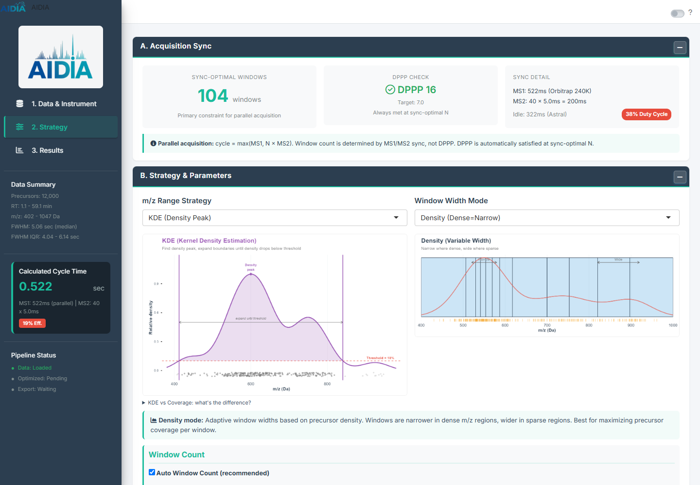
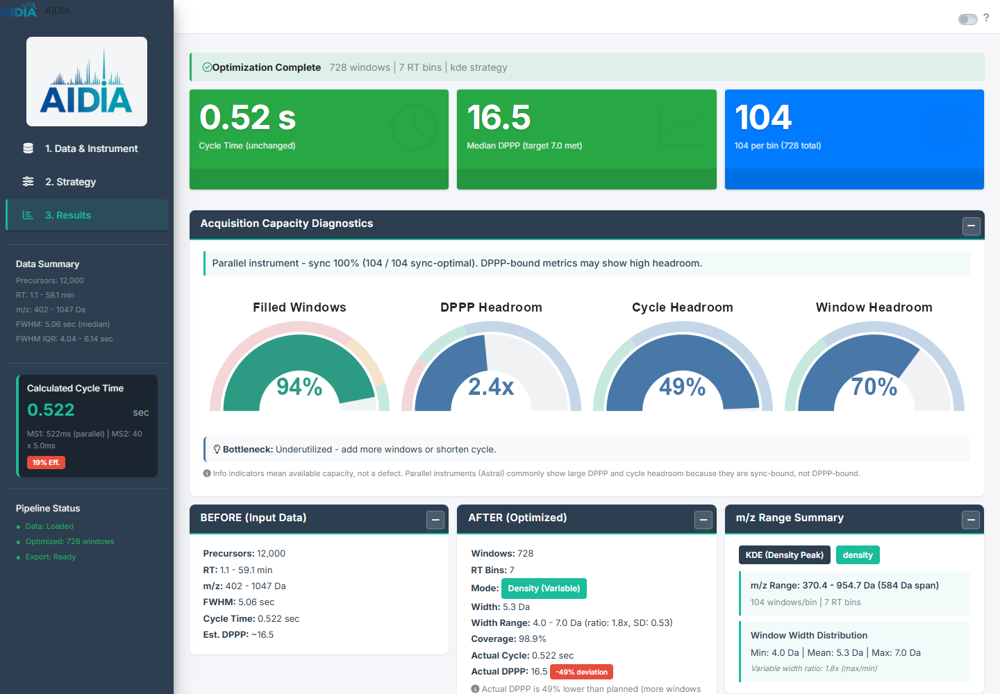
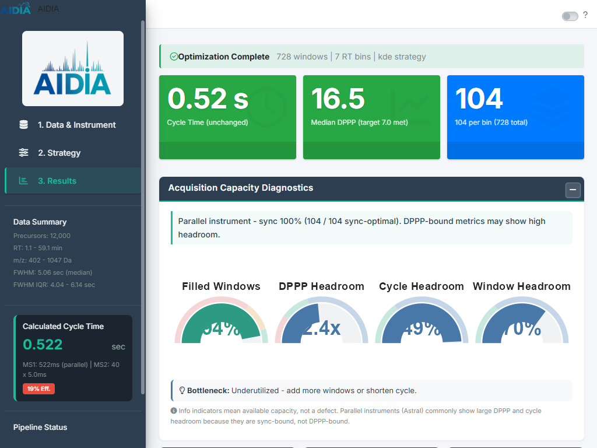
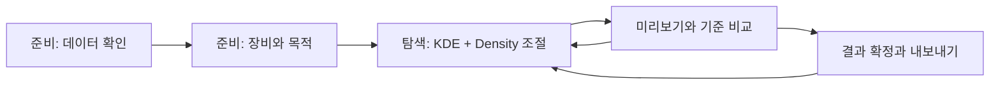

# Shiny 실제 화면 UX 검토

2026-09-08. 검토 대상: `shiny-workflow-ux`, 기준 커밋 `86c9c4b`, worktree 소스를 로드한 AIDIA 0.4.1. 기존 설치본 0.4.0의 화면이 아니다.

## 결론

**처음에는 준비 과정을 안내하고, 준비 이후에는 파라미터·결과·비교를 한 화면에서 반복하는 작업 공간으로 전환하는 것이 적절하다.** 현재 화면은 정보를 충분히 제공하지만, 사용자가 그 정보를 보고 무엇을 해야 하는지 결정하는 데 드는 부담이 크다.

KDE + Density를 시작점으로 삼고, KDE의 두 핵심 파라미터를 실제 데이터 그래프 옆에 배치한다. 실시간 갱신과 함께 결과 해석, 이전 설정 비교, 되돌리기, 확정 결과 표시를 구현해야 탐색이 쉬워진다.

## 실제 확인 범위

- 로컬 Shiny를 `http://127.0.0.1:3876`에서 실행했다. Orca 내장 브라우저의 snapshot/screenshot은 runtime 연결 오류로 실패하여 별도 Edge headless와 Playwright로 확인했다.
- 12,000개 합성 precursor를 담은 `aidia-ux-synthetic.parquet`를 UI에서 업로드했다. 실험 성능을 검증하는 데이터가 아니다.
- Astral Zoom 기본 조건에서 KDE + Density를 선택하고 최적화 완료, 결과 확인, 설정 변경 후 결과 재방문을 수행했다.
- 1440 × 1000과 1024 × 768 viewport를 확인했다. 초기 스크린샷 일부는 spinner 전환 중 촬영되어, 출력이 준비되고 전환이 끝난 뒤 다시 촬영했다.
- 실제 사용자 테스트, screen reader 테스트, 모바일·다른 장비 전체 경로, 다운로드 파일 내용 검증은 이번 검토에 포함하지 않았다.
- 앱/알고리즘 코드는 변경하지 않았다. 아래 판단은 관찰된 화면에 대한 UX 평가이며, 과학적 계산의 정확성을 판정한 결과가 아니다.

## 우선순위별 관찰과 개선

### 1. 설정과 효과를 같은 화면에 둔다 — 최우선

1440 × 1000에서 Strategy 화면의 첫 화면은 sync 요약과 알고리즘 설명 이미지가 대부분을 차지한다. KDE threshold와 minimum coverage는 첫 화면 아래에 있다. 설정 페이지 전체 높이는 약 2,429px이며 실제 분포 결과를 보려면 최적화를 실행하고 Results로 이동해야 한다.

개선: 설명 이미지는 “KDE가 범위를 선택하는 방법” 도움말로 이동하고, 그 자리에 실제 업로드 데이터 분포를 표시한다. 왼쪽 300–340px 정도의 조절 영역에 핵심 파라미터를 놓고 오른쪽에 RT × m/z 개요와 선택 RT 구간의 상세 분포를 보여준다. 조절 영역 폭은 설계 시작값이며 실제 반응형 검증으로 조정한다.

선택 RT 구간을 바꿔도 축 범위와 의미를 가능한 한 유지한다. 모든 RT bin의 작은 그래프를 한꺼번에 보여주기보다 개요에서 구간을 선택해 크게 본다. 확대는 보기 범위를 바꾸는 동작이며 분석 입력을 필터링하는 동작과 구분한다.

### 2. “이 결과가 괜찮은가?”에 일관되게 답한다 — 최우선

같은 결과 화면에서 다음 표현을 동시에 관찰했다.

- 상단: `Median DPPP (target 7.0 met)`, 값 16.5.
- 진단 설명: `sync 100% (104 / 104 sync-optimal)`.
- 진단 권고: `Underutilized - add more windows or shorten cycle`.
- AFTER: 빨간 `-49% deviation`과 planned 대비 낮다는 설명.
- 사이드바: 현재 입력의 window count 40을 사용한 `19% Eff.`.

이는 서로 다른 조건과 기준이 한 화면에 섞여 보이는 UX 문제다. 여기서 어느 계산이 틀렸다고 단정하지는 않는다. 사용자에게는 “목표를 달성했는지”, “실제로 수정할 항목이 있는지”, “단순 참고 정보인지”가 먼저 구분되어야 한다.

개선: 결과의 공통 설정을 기준으로 상단 판정 한 개를 만든다. 예를 들어 실제 검증 결과에 맞춰 “설정한 측정점 목표를 충족했습니다”를 먼저 보여주고, 경고에는 해당 조건과 조정 가능한 항목을 연결한다. 계획 대비 차이와 목표 미달은 별도 항목이다. 장비 제약상 여유가 있어도 추가 window를 권할 수 없는 경우 일률적인 권고를 내리지 않는다.

사이드바의 편집 중인 입력 지표와 완료 결과 지표를 함께 쓸 경우 제목에 기준을 명시한다. 결과 화면의 요약은 완료 결과 조건에서 가져온다. 녹색·빨간색은 실제 판정에만 사용하고, available headroom 같은 설명 지표는 중립색으로 둔다. 색만 바꾸는 것으로 해결하지 않고 판정과 권고의 조건도 함께 정리한다.

### 3. 변경 전 결과와 현재 미리보기를 구분한다 — 최우선

KDE 결과를 만든 뒤 설정에서 전략을 Coverage로 변경하고 Results를 다시 열었다. 결과는 KDE로 보존되었지만, 현재 설정이 달라졌다는 배너는 없었다. **이전 완료 결과를 보존하는 동작은 최근 커밋과 일치하므로 유지하고, 그 관계를 화면에 드러내는 것이 필요하다.**

개선: “편집 중인 설정”, “이 설정의 미리보기”, “확정한 결과” 상태를 명확히 표시한다. 계산 중에는 그래프를 지우거나 전체 화면을 덮지 않고 마지막 그래프 위에 “변경 중 · 이전 설정 표시”를 작게 표시한다. 최신 계산이 완료되면 그래프와 지표를 한 묶음으로 바꾼다. 과거 요청이 늦게 끝나도 현재 결과처럼 표시하지 않는다.

“이 설정으로 결과 확정”은 현재 설정에 일치하는 전체 결과에만 적용한다. 다운로드 영역에는 확정 설정 요약과 시각을 표시한다. 설정을 바꿔도 예전 다운로드 기준이 몰래 바뀌지 않게 한다.

### 4. 반복 실험을 돕는 비교·되돌리기를 제공한다 — 높음

현재 반복 경로는 설정 변경 → 실행 → 결과 이동 → 숫자를 기억 → 다시 설정이다. 이를 매번 반복하면 좋은 조건을 찾는 과정에서 사용자의 기억에 의존하게 된다.

개선: `기준으로 고정`, `이전 변경 취소`, `기준으로 되돌리기`를 제공한다. baseline은 동일 데이터에서 선택한 설정 스냅샷이다. 현재 설정과 baseline의 다른 값만 요약하고, 그래프를 같은 축에 겹쳐 보거나 나란히 비교한다. 변화량은 절대값과 함께 표시한다. baseline 변경/복원은 전체 분석 초기화와 다른 동작이다.

초기에는 baseline 1개와 현재 설정만 지원하면 충분하다. 모든 파라미터 조합의 자동 탐색·순위 매기기는 이번 UX 개선과 별도의 기능이다. coverage 증가를 실험 성능 향상으로 자동 해석하지 않는다.

### 5. 결과 확인과 다운로드를 가까이 둔다 — 높음

Results는 1440px 폭에서 약 2,795px 높이다. 다운로드는 capacity gauges, 전후 요약, 두 개의 큰 분포 그래프, 접힌 상세 표 아래에 있다. 첫 화면에서는 완료했음을 알아도 다음 행동을 찾기 어렵다.

개선: 상단 요약 바로 옆에 `Method 다운로드`를 주 행동으로 놓는다. format과 export 옵션은 간결한 패널에서 확인하고, PDF·ZIP은 보조 동작으로 둔다. 화면 내 이동이 필요하면 버튼이 해당 패널로 이동하게 한다. 결과 하위 영역은 요약/상세 진단/윈도우 표로 구성해 접근성을 유지한다.

전체 CSV 헤더와 고정 예제 행은 “형식 예시”로 접는다. 현재 결과에서 추출한 행을 보여줄 경우에만 실제 파일 미리보기라고 명명한다. 파일명, 장비, 전략과 옵션은 다운로드 직전에 확인할 수 있어야 한다.

### 6. 화면 공간과 시각적 강조를 다시 배분한다 — 높음

250px 사이드바가 항상 열려 있으며 큰 로고, 단계, 데이터 요약, cycle time, pipeline 상태를 함께 담고 있다. 1024px 화면에서는 사이드바가 폭의 약 24%를 차지한다. 1024 × 768 재촬영에서는 capacity gauge의 숫자가 일부 가려지는 모습도 관찰했다.

개선: 로고를 작게 하고 상단에 단계/현재 데이터/장비 요약을 배치한다. 좁은 화면에서는 탐색을 접을 수 있게 하고 파라미터 영역을 drawer 또는 세로 배치로 전환한다. 기존 CSS의 sidebar 강제 표시 규칙과 JS의 collapse 취소를 함께 검토한다.

모든 섹션에 진한 header와 accent line을 주기보다, 큰 제목 → 주요 그래프 → 보조 설명의 위계를 만든다. 핵심 도움말은 기본 13–14px 수준을 출발점으로 검토하고, 전문 설명을 10–11px로 작게 넣어 정보량을 해결하지 않는다. 텍스트 대비는 실제 측정 전이므로 WCAG 적합 여부를 단정하지 않는다.

## 추천 정보 구조: 준비 → 탐색 → 내보내기

이전 제안의 데이터 확인·장비 설정·조절·확정이라는 네 작업은 유지한다. 다만 네 작업을 매번 지나야 하는 wizard로 만들지 않고 첫 두 작업을 “준비” 안의 안내 단계로 묶는다.

| 영역 | 항상 보이는 것 | 필요할 때 여는 것 |
|---|---|---|
| 상단 | 데이터·장비 요약, 현재 상태, 준비/탐색/내보내기 | 데이터·장비 수정 |
| 탐색 왼쪽 | KDE threshold, minimum coverage, window 수 자동/수동 | 다른 전략, 폭 제약, RT 설정, FZ 상세 |
| 탐색 오른쪽 | 실제 데이터 개요, 선택 RT 분포와 window, 핵심 목표 충족 | 전체 bin 상세, 수식과 알고리즘 설명 |
| 비교 | 현재 값, baseline 대비 차이, 변경한 설정 | 자세한 설정 비교 |
| 하단/상단 행동 영역 | 기준 복원, 결과 확정 | 새 분석 시작 |

그래프가 너무 많아지는 것을 막기 위해 첫 기본 뷰는 “전체 RT 개요 + 선택 구간 상세”로 제한한다. 연동 선택 상태는 두 그래프에 동일하게 표시한다. 일단 데이터가 준비되면 파라미터 조절 때문에 다른 단계로 이동시키지 않는다.

## KDE 설정의 문구 제안

| 현재 문구 | 제안 |
|---|---|
| Density Threshold (%) | `KDE peak 대비 경계 기준 (%)` + “낮추면 대체로 더 넓은 범위를 선택합니다.” |
| Minimum Coverage (%) | `범위 선택의 최소 포함 목표 (%)` + “이후 생성된 최종 window coverage는 별도로 확인합니다.” |
| Auto Window Count | `장비 조건에서 window 수 계산` + 산출된 수와 근거 표시 |
| Run Optimization | 자동 미리보기 + `이 설정으로 결과 확정` |
| New Analysis | `다른 데이터로 새 분석` + 초기화 범위 안내 |

threshold를 바꿔도 minimum coverage 제약이나 digitization으로 결과가 같을 수 있다. 같은 결과일 때에도 현재 값과 적용된 제약을 설명한다. KDE 알고리즘의 minimum coverage 조건과 최종 window의 실제 unique coverage를 같은 숫자로 취급하지 않는다. 문구는 설계 의미를 보여주는 한국어 예시이며, 기존 영어 UI에 적용할 때 일관되게 번역한다.

## 구현 순서

1. 판정·설정 기준·경고 문구를 정리하고 데이터/설정/결과 상태 계약을 확정한다.
2. KDE + Density 탐색 화면의 실제 데이터 preview를 연결한다. 목표는 “설정 바꾸기 → 효과 확인”을 이동 없이 수행하는 것이다.
3. baseline 비교·복원과 최신 요청 처리를 연결한다.
4. 결과 확정·상단 다운로드·상세 진단 및 좁은 화면 배치를 완성한다.
5. 처음 쓰는 연구자에게 설명 없이 threshold 조절, 기준 복원, 결과 해석, 다운로드 과제를 수행하게 해 검증한다.

사용성 성공 기준은 화면이 예뻐졌는지가 아니라, 사용자가 무엇을 바꿨고 어떤 결과가 달라졌는지 설명하고 이전 조건으로 복원할 수 있는지다. 기존안과 비교해 화면 왕복 횟수, 도움 요청, 현재/과거 결과 혼동을 기록한다.

## 근거와 한계

위 개선안은 저장된 실제 화면과 조작 결과에 대한 설계 판단이다. 상태 가시성, 사용자 제어·복원, 기억 부담 감소는 [Nielsen Norman Group의 사용성 원칙](https://www.nngroup.com/articles/ten-usability-heuristics/)과 연결된다. 핵심 작업을 기본 화면에 두고 덜 쓰는 상세를 나누는 방식은 [Progressive Disclosure](https://www.nngroup.com/articles/progressive-disclosure/)를 참고했다. 이 원칙이 AIDIA에서 개선 효과를 입증한 것은 아니므로 사용자 과제로 확인해야 한다.

화면 캡처와 텍스트는 [assets](2026-09-08-shiny-ux-assets/)에 있다. 실시간 계산의 기술 가능성과 합성 데이터 측정은 [별도 검토](../plans/2026-09-08-shiny-live-preview-feasibility.md)에 기록되어 있다.
