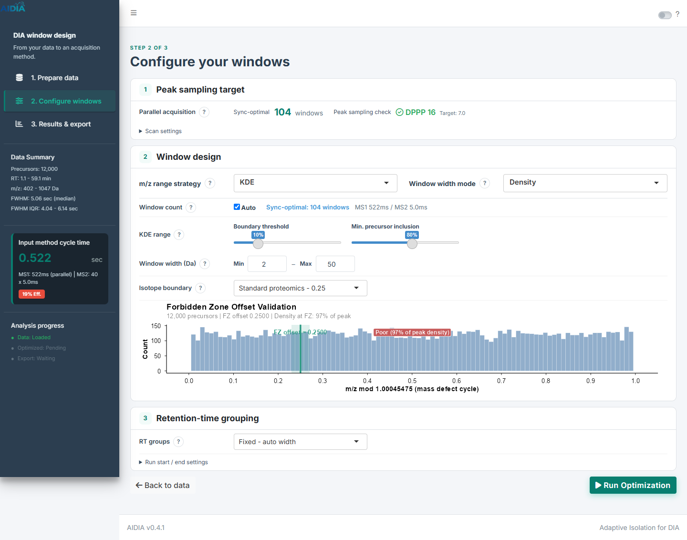

# Configure windows: 구획과 파라미터 배치 개선

2026-09-10 · `Hayoung-hiro/shiny-workflow-ux` · 기준 커밋 `86c9c4b`

이전 변경에서 설명을 접는 것만으로는 파라미터의 소속과 중요도가 명확해지지 않았다. 이번에는 Configure windows를 세 가지 결정 영역으로 다시 구성했다.

| 구획 | 기본 화면 | 관련 상세 설정 |
|---|---|---|
| 1. Peak sampling target | 순차 기기의 DPPP·목표 달성 비율·프리셋, 또는 병렬 기기의 동기화·샘플링 확인 | MS1 scans/cycle |
| 2. Window design | KDE + Density 선택, window count, 전략별 파라미터, 최소·최대 폭, isotope boundary와 그림 | 각 항목 옆 `?` 설명 |
| 3. Retention-time grouping | 그룹 생성 방식과 해당 방식의 파라미터 | RT 시작 buffer·마지막 그룹 merge |

세 구획은 항상 펼쳐 둔다. Window count와 KDE range는 데스크톱에서 각각 한 줄이며, 최소·최대 폭은 같은 입력 스타일의 **Window width (Da): Min – Max**로 묶었다. RT 설정도 독립된 구획으로 항상 보인다. 추가 설정은 해당 구획 안으로 이동했다.

설명과 방법별 예시 그림은 항목 바로 옆의 `?`를 클릭해 확인한다. 키보드로 열 수 있고 Escape나 바깥 클릭으로 닫힌다. 업로드 데이터에 대한 isotope boundary 그림은 offset이 활성화된 경우 기본 화면에 표시한다. 좁은 화면에서는 컨트롤을 세로로 배치하고 그림 영역 내부만 가로로 스크롤한다.

## 실제 화면

합성 precursor 12,000개를 업로드한 Shiny 앱을 Edge에서 확인했다. 디자인 검토용 데이터이며 과학적 성능을 입증하는 실험은 아니다.

| 화면 | 캡처 |
|---|---|
| 이전 1차 변경 | [전체 화면](2026-09-10-design-pass-assets/03-settings.png) |
| 새 구성 · Astral | [전체 화면](2026-09-10-compact-pass-assets/01-configure.png) |
| 항목 옆 도움말 | [KDE 도움말](2026-09-10-compact-pass-assets/02-context-help.png) |
| Adaptive RT 설정 | [그룹 파라미터](2026-09-10-compact-pass-assets/03-adaptive-groups.png) |
| 순차 기기 · Exploris | [DPPP 설정](2026-09-10-compact-pass-assets/04-sequential.png) |
| 1024px / 390px | [태블릿](2026-09-10-compact-pass-assets/05-tablet.png) · [모바일](2026-09-10-compact-pass-assets/06-mobile.png) |
| 모바일 도움말 | [화면 안에 배치된 도움말](2026-09-10-compact-pass-assets/07-mobile-help.png) |

동일한 1440px 폭의 전체 캡처 높이는 이전 1차 변경의 1,635px에서 1,132px로 약 31% 줄었다. 이번에는 RT 구획과 isotope boundary 그림을 펼친 상태다. 화면 길이 비교이며 사용성 평가 결과를 뜻하지 않는다.

## 범위와 확인

이번 수정 파일은 `ui_step2_setup.R`, `www/custom.css`, `www/configure-help.js`다. 이전 worktree의 1차 변경 위에 적용했다. 계산 함수·server 모듈·input ID·수치 기본값과 허용 범위·export 형식은 그대로 유지했다. KDE + Density 시작 선택도 유지했다.

- Shiny R 파일 전체 구문 검사와 `git diff --check` 통과.
- 다섯 전략, 세 window mode, 수동 window count, 세 RT mode와 관련 입력 표시 확인.
- Astral / Exploris 전환과 DPPP 프리셋 세 가지 확인.
- Custom / 0.18 / disabled / 0.25 offset 전환, offset 변경 시 그림 갱신 확인.
- 기본 설정 최적화 후 Thermo CSV 다운로드: 728개 결과 행, 8개 열. 앞선 기본 설정 실행과 동일한 행·열 수이며 수치 전체 동등성 검증은 아니다.
- 1440px·1024px·390px에서 페이지 가로 넘침 없음. 모바일 그래프 내부 스크롤 확인.
- 도움말 클릭·키보드 열기·Escape·바깥 클릭·모바일 위치 확인. 모바일에서 스크롤 후 도움말이 바로 닫히던 문제 수정.
- 브라우저 JavaScript 오류 및 Shiny output 오류 없음. 실행 환경의 기존 locale 경고와 합성 데이터 plot 경고는 남아 있다.

이 단계에서는 전체 최적화의 실시간 실행 구조를 추가하지 않았다. 기존에 반응형으로 구현된 isotope boundary 그림은 offset 변경에 따라 갱신되며, 나머지 최적화 결과는 Run Optimization으로 갱신한다.

로컬 검토 앱: [http://127.0.0.1:3877](http://127.0.0.1:3877)
