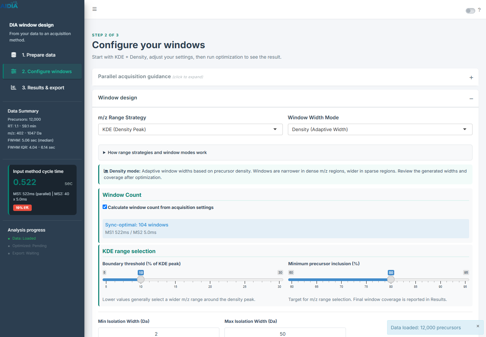
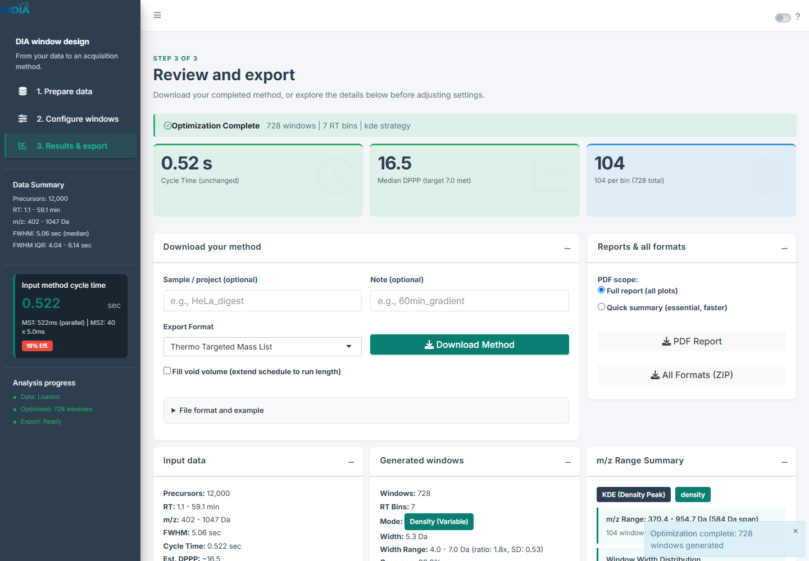

# Shiny UI 1차 변경 — 디자인 확인용

2026-09-10. 작업 브랜치: `Hayoung-hiro/shiny-workflow-ux`, 기반 커밋: `86c9c4b`.

## 변경 내용

- 기본 선택을 KDE + Density로 변경했다. KDE threshold 10%, minimum coverage 80% 등 개별 수치는 기존 앱 값을 유지했다.
- 기존 3단계 흐름에 화면 제목과 한 문장 안내를 추가했다: Prepare your data → Configure your windows → Review and export.
- sidebar의 큰 로고를 간결한 소개로 바꾸고, cycle time이 입력 method 기준임을 제목에 명시했다. 좁은 화면에서 탐색 영역을 접을 수 있도록 AdminLTE 기본 동작을 복원했다.
- 데이터 화면의 장비 설정을 큰 화면에서 2열로 정리하고 Timing details를 접었다.
- 설명용 전략 그림은 도움말로 이동하고 실제 데이터 그래프가 아님을 명시했다. KDE 두 파라미터를 나란히 배치하고 의미를 설명했다.
- parallel acquisition guidance, RT binning, 추가 acquisition 설정과 FZ 상세 그림을 필요할 때 펼칠 수 있게 했다.
- 결과 요약 바로 아래로 method 다운로드를 옮겼다. PDF·ZIP은 보조 버튼으로 정리하고 CSV 형식 예시는 접었다.
- 결과의 capacity·temporal density 상세를 접고, capacity plot은 좁은 화면에서 내부 가로 스크롤로 열람하게 했다.
- 진한 섹션 header를 밝은 surface와 경계선으로 바꾸고, 주요 버튼은 짙은 teal로 통일했다. 성공/정보 KPI는 연한 배경과 색상 경계로 표현했다. 도움말 텍스트의 기본 색을 더 진하게 조정했다.

계산 함수, server 모듈, reactive 실행 구조, 파라미터 범위, package API 기본값, export 형식은 수정하지 않았다. 실시간 미리보기·baseline 비교·변경된 설정 감지와 결과 판정 조건의 정리는 다음 단계의 범위이다.

## 화면 비교

합성 데이터 12,000개, Astral Zoom, KDE + Density, 1440 × 1000에서 촬영했다. 아래 이미지는 설명용 모형이 아닌 실행된 Shiny 화면이다.

| 화면 | 변경 전 | 변경 후 |
|---|---|---|
| 데이터 준비 | [이전 화면](2026-09-08-shiny-ux-assets/01-empty-viewport.png) | [새 화면](2026-09-10-design-pass-assets/01-prepare-viewport.png) |
| KDE 설정 | [이전 화면](2026-09-08-shiny-ux-assets/03-kde-setup-viewport.png) | [새 화면](2026-09-10-design-pass-assets/03-settings-viewport.png) |
| 결과·다운로드 | [이전 화면](2026-09-08-shiny-ux-assets/04-results-viewport.png) | [새 화면](2026-09-10-design-pass-assets/04-results-viewport.png) |

같은 desktop viewport에서 기본으로 펼쳐진 설정 화면의 전체 높이는 약 2,429px에서 1,574px로 줄었다. 결과 화면은 약 2,795px에서 2,080px로 줄었고 method 다운로드 버튼은 화면 상단에서 약 596px 위치에 표시된다. 글자/브라우저 크기에 따라 달라지는 참고값이며 사용성 개선율로 해석하지 않는다.

## 검증

- Shiny R 파일 전체 구문 검사 통과.
- `devtools::test(filter = "strategy-comparison|method-delivery")` 통과.
- Edge 브라우저에서 KDE + Density 기본 선택 확인, 합성 parquet 업로드, 다섯 전략 전환, 설명 그림 펼치기, 최적화 완료 확인.
- Thermo / Center Mass / m/z Range CSV 다운로드 확인: 각 728개 결과 행, 형식별 8 / 2 / 1개 열. 해당 실행에서는 7 RT bins, bin당 104 windows를 생성했다.
- Astral에서 Exploris로 변경한 뒤 DPPP 설정 표시 확인. 1440px·1024px·390px에서 화면 확인, 390px에서 document 가로 넘침 없음.
- 브라우저 검사에서 JavaScript page error와 Shiny output error 없음. R 실행 로그에는 기존 locale/build-version 경고 및 plot/rt_group 경고가 관찰되었다. 과학적 결과 검증이나 전체 package test suite 실행을 대신하는 검사는 아니다.

검토용 앱은 `http://127.0.0.1:3877`에서 실행했다. 앱 실행 환경이 종료되어도 이 문서의 캡처로 디자인을 확인할 수 있다.

## 디자인 검토 시 확인할 점

1. KDE 두 파라미터의 의미와 다음 행동을 설명 없이 이해할 수 있는가?
2. 접힌 도움말·상세 설정을 쉽게 찾아 열 수 있는가?
3. 결과를 보자마자 다운로드 위치를 찾을 수 있는가?
4. 밝은 header와 줄어든 색상 강조가 읽기 편한가?

이번 변경은 사용자 요청에 따라 먼저 검토할 수 있는 시각·문구·배치 단계이다. 파라미터를 조절하며 결과를 자동으로 확인하는 탐색 화면은 이 디자인 검토 후 확장한다.
